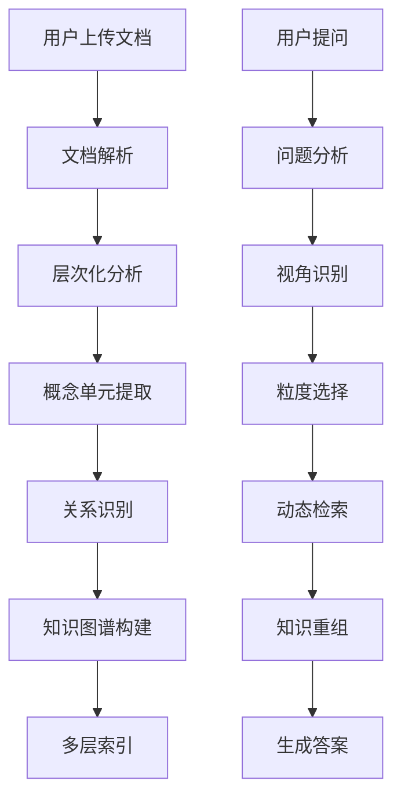
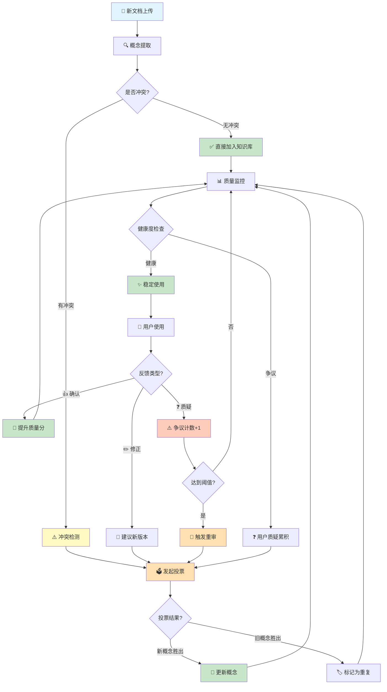

# 层次化语义知识提取与检索系统 (Hierarchical Semantic RAG)

> 文档版本: v1.0  
> 创建日期: 2025-12-08  
> 作者: AI Reviewer Team

---

## 📖 系统概述

### 核心理念

**传统 RAG 的问题**：
- 扁平化的文档切片，丢失层次结构
- 固定粒度检索，无法适应不同查询视角
- 缺乏语义完整性保证

**我们的方案**：
- **层次化语义单元提取**：识别概念的最小完整描述
- **多层嵌套知识结构**：保留文档组织关系
- **视角导向检索**：根据问题动态选择知识粒度

### 关键概念

```yaml
概念单元 (Concept Unit):
  定义: 一个独立、完整的语义最小单位
  特征:
    - 自包含：脱离上下文仍可理解
    - 完整性：包含概念的核心要素
    - 原子性：不可再分割而不失去意义
  
  示例:
    文本: "Docker 是一个容器化平台，允许开发者将应用及其依赖打包成轻量级、可移植的容器"
    概念单元:
      - name: "Docker"
      - type: "技术平台"
      - definition: "容器化平台"
      - features: ["打包应用", "包含依赖", "轻量级", "可移植"]
      - purpose: "简化应用部署"
```

---

## 🏗️ 系统架构

### 整体流程



### 核心模块

```
┌─────────────────────────────────────────────────────────────┐
│                    索引阶段 (Indexing Phase)                 │
├─────────────────────────────────────────────────────────────┤
│  1. 文档解析器 (DocumentParser)                             │
│     - 识别文档结构 (标题、段落、列表...)                     │
│     - 提取元数据 (作者、时间、主题...)                       │
│                                                              │
│  2. 层次分析器 (HierarchyAnalyzer)                          │
│     - 识别概念层级                                           │
│     - 构建文档树结构                                         │
│                                                              │
│  3. 概念提取器 (ConceptExtractor)                           │
│     - 识别最小语义单元                                       │
│     - 提取概念属性 (定义、特征、示例...)                     │
│                                                              │
│  4. 关系识别器 (RelationIdentifier)                         │
│     - 概念内关系 (属性关联)                                  │
│     - 概念间关系 (依赖、对比、继承...)                       │
│     - 跨文档关系 (引用、扩展、矛盾...)                       │
│                                                              │
│  5. 知识存储器 (KnowledgeStore)                             │
│     - 层次化存储结构                                         │
│     - 多粒度索引                                             │
│     - 关系图谱                                               │
└─────────────────────────────────────────────────────────────┘

┌─────────────────────────────────────────────────────────────┐
│                    演化阶段 (Evolution Phase) 🆕             │
├─────────────────────────────────────────────────────────────┤
│  1. 反馈收集器 (FeedbackCollector)                          │
│     - 用户显式反馈（点赞/点踩/评论）                         │
│     - 隐式行为分析（停留时间、跳过率）                       │
│     - 专家审核标注                                           │
│                                                              │
│  2. 冲突检测器 (ConflictDetector)                           │
│     - 识别矛盾概念（相同名称不同定义）                       │
│     - 检测过时信息（基于时间戳）                             │
│     - 发现不一致性（跨文档对比）                             │
│                                                              │
│  3. 投票仲裁器 (VotingArbiter)                              │
│     - 多源投票机制（用户、专家、模型）                       │
│     - 加权评分系统                                           │
│     - 争议阈值判断                                           │
│                                                              │
│  4. 概念更新器 (ConceptUpdater)                             │
│     - 版本管理（保留历史版本）                               │
│     - 增量修正（部分更新）                                   │
│     - 影响传播（更新相关概念）                               │
│                                                              │
│  5. 质量监控器 (QualityMonitor)                             │
│     - 概念健康度评分                                         │
│     - 争议度追踪                                             │
│     - 自动触发重审                                           │
└─────────────────────────────────────────────────────────────┘

┌─────────────────────────────────────────────────────────────┐
│                    检索阶段 (Retrieval Phase)                │
├─────────────────────────────────────────────────────────────┤
│  1. 问题分析器 (QueryAnalyzer)                              │
│     - 意图识别 (定义查询、对比查询、实操查询...)             │
│     - 视角识别 (概念层、实现层、应用层...)                   │
│     - 粒度需求 (最小单元、章节级、文档级...)                 │
│                                                              │
│  2. 检索策略器 (RetrievalStrategy)                          │
│     - 单点深入 (Single Concept Deep Dive)                   │
│     - 横向对比 (Horizontal Comparison)                      │
│     - 纵向追溯 (Vertical Tracing)                           │
│     - 网络扩散 (Network Expansion)                          │
│                                                              │
│  3. 知识重组器 (KnowledgeReorganizer)                       │
│     - 按问题视角重组知识                                     │
│     - 补全缺失的上下文                                       │
│     - 生成结构化答案                                         │
└─────────────────────────────────────────────────────────────┘
```

---

## 🔍 概念单元提取 (Concept Extraction)

### 提取策略

#### 1. 基于 LLM 的语义分割

**Prompt 设计**：

```
你是一个知识提取专家。请从以下文档片段中提取所有独立的概念单元。

文档片段：
{text}

提取要求：
1. 每个概念单元必须是完整的、自包含的
2. 提取概念的核心要素：名称、定义、特征、示例、关系
3. 识别概念的层级关系（父概念、子概念）

输出格式（JSON）：
{
  "concepts": [
    {
      "id": "concept_001",
      "name": "概念名称",
      "type": "概念类型（技术/流程/原理/工具...）",
      "definition": "核心定义",
      "attributes": {
        "features": ["特征1", "特征2"],
        "examples": ["示例1"],
        "use_cases": ["应用场景1"]
      },
      "relations": {
        "parent": "父概念ID",
        "children": ["子概念ID"],
        "related": ["相关概念ID"],
        "depends_on": ["依赖概念ID"]
      },
      "context": {
        "section": "所属章节",
        "importance": 0.9,
        "completeness": "完整|部分|引用"
      }
    }
  ]
}
```

#### 2. 渐进式细化

```java
public class ConceptExtractor {
    
    private final LLMClient llmClient;
    
    /**
     * 多轮提取：从粗到细
     */
    public List<Concept> extract(String documentContent) {
        // 第一轮：识别主要概念（章节级）
        List<Concept> mainConcepts = extractMainConcepts(documentContent);
        
        // 第二轮：细化每个主要概念
        for (Concept concept : mainConcepts) {
            List<Concept> subConcepts = extractSubConcepts(concept);
            concept.setChildren(subConcepts);
        }
        
        // 第三轮：提取概念属性
        for (Concept concept : getAllConcepts(mainConcepts)) {
            extractAttributes(concept);
        }
        
        // 第四轮：识别关系
        identifyRelations(mainConcepts);
        
        return mainConcepts;
    }
    
    /**
     * 提取最小语义单元
     */
    private List<Concept> extractSubConcepts(Concept parentConcept) {
        String prompt = String.format("""
            从以下概念描述中提取最小的独立概念单元：
            
            概念：%s
            描述：%s
            
            要求：
            1. 每个单元可以独立理解
            2. 保持语义完整性
            3. 标注与父概念的关系
            """, parentConcept.getName(), parentConcept.getContent());
        
        String response = llmClient.chat(prompt);
        return parseConceptsFromJson(response);
    }
}
```

---

## 📊 层次化知识结构

### 存储模型

```java
/**
 * 概念单元数据模型
 */
@Data
public class ConceptUnit {
    
    // 基本信息
    private String id;                    // 唯一标识
    private String name;                  // 概念名称
    private ConceptType type;             // 类型
    private int level;                    // 层级（0=文档，1=章节，2=概念，3=子概念...）
    
    // 语义信息
    private String definition;            // 核心定义
    private String description;           // 详细描述
    private List<String> keywords;        // 关键词
    private List<String> examples;        // 示例
    
    // 层次关系
    private String parentId;              // 父概念
    private List<String> childrenIds;     // 子概念
    private int depth;                    // 深度
    
    // 横向关系
    private List<Relation> relations;     // 与其他概念的关系
    
    // 上下文信息
    private String sourceDocument;        // 来源文档
    private String section;               // 所属章节
    private int position;                 // 文档中的位置
    
    // 质量评分
    private double completeness;          // 完整性 (0-1)
    private double independence;          // 独立性 (0-1)
    private double importance;            // 重要性 (0-1)
    
    // 向量表示
    private float[] embedding;            // 语义向量
    
    // 🆕 演化相关字段
    private int version;                  // 当前版本号
    private LocalDateTime createdAt;      // 创建时间
    private LocalDateTime updatedAt;      // 最后更新时间
    private int disputeCount;             // 争议次数
    private double healthScore;           // 健康度评分
    private String currentVotingSessionId; // 当前投票会话ID（如果正在投票中）
    
    // 元数据
    private Map<String, Object> metadata;
}

/**
 * 概念关系
 */
@Data
public class Relation {
    private String targetId;              // 目标概念
    private RelationType type;            // 关系类型
    private double strength;              // 关系强度
    private String description;           // 关系描述
}

enum RelationType {
    IS_A,           // 是一种
    PART_OF,        // 是...的一部分
    DEPENDS_ON,     // 依赖于
    SIMILAR_TO,     // 类似于
    OPPOSITE_TO,    // 相对于
    IMPLEMENTS,     // 实现
    EXTENDS,        // 扩展
    USES,           // 使用
    RELATED_TO      // 相关
}
```

### 多层索引

```java
/**
 * 多层知识索引
 */
public class HierarchicalKnowledgeIndex {
    
    // 层级索引：按层级组织概念
    private Map<Integer, List<ConceptUnit>> levelIndex;
    
    // 类型索引：按类型组织概念
    private Map<ConceptType, List<ConceptUnit>> typeIndex;
    
    // 向量索引：语义相似度检索
    private VectorIndex vectorIndex;
    
    // 关系图：概念关系网络
    private Graph<ConceptUnit, Relation> relationGraph;
    
    // 文档树：保留原始文档结构
    private Map<String, ConceptTree> documentTrees;
    
    /**
     * 按粒度检索
     */
    public List<ConceptUnit> searchByGranularity(String query, int targetLevel) {
        // 先进行语义检索
        List<ConceptUnit> candidates = vectorIndex.search(query);
        
        // 筛选目标层级的概念
        return candidates.stream()
            .filter(c -> c.getLevel() == targetLevel)
            .collect(Collectors.toList());
    }
    
    /**
     * 向上追溯：获取完整上下文
     */
    public List<ConceptUnit> traceUp(ConceptUnit concept) {
        List<ConceptUnit> path = new ArrayList<>();
        ConceptUnit current = concept;
        
        while (current.getParentId() != null) {
            current = getConceptById(current.getParentId());
            path.add(0, current);  // 添加到路径开头
        }
        
        return path;
    }
    
    /**
     * 向下展开：获取所有子概念
     */
    public List<ConceptUnit> expandDown(ConceptUnit concept, int maxDepth) {
        List<ConceptUnit> result = new ArrayList<>();
        expandRecursive(concept, maxDepth, 0, result);
        return result;
    }
    
    /**
     * 横向扩展：获取相关概念
     */
    public List<ConceptUnit> expandHorizontal(ConceptUnit concept, int maxHops) {
        // 使用图遍历算法（BFS）
        return relationGraph.bfs(concept, maxHops);
    }
}
```

---

## 🎯 视角导向检索 (Perspective-Oriented Retrieval)

### 问题视角分类

```yaml
视角类型:
  1. 定义视角 (Definition):
      问题: "什么是X？"
      检索策略: 单点深入 → 获取概念核心定义
      粒度: 最小概念单元
      
  2. 实现视角 (Implementation):
      问题: "X如何实现？"
      检索策略: 纵向追溯 → 获取实现细节
      粒度: 子概念 + 示例
      
  3. 对比视角 (Comparison):
      问题: "X和Y有什么区别？"
      检索策略: 横向对比 → 获取多个概念
      粒度: 同级概念单元
      
  4. 应用视角 (Application):
      问题: "X有什么用？"
      检索策略: 网络扩散 → 获取应用场景
      粒度: 关联概念 + 用例
      
  5. 全局视角 (Holistic):
      问题: "整体架构是什么？"
      检索策略: 树状展开 → 获取完整层次
      粒度: 文档级 + 章节级
```

### 检索策略实现

```java
/**
 * 视角导向检索器
 */
public class PerspectiveOrientedRetriever {
    
    private final HierarchicalKnowledgeIndex index;
    private final LLMClient llmClient;
    
    /**
     * 主检索接口
     */
    public RetrievalResult retrieve(String question) {
        // 1. 分析问题视角
        Perspective perspective = analyzePerspective(question);
        
        // 2. 选择检索策略
        RetrievalStrategy strategy = selectStrategy(perspective);
        
        // 3. 执行检索
        List<ConceptUnit> concepts = strategy.search(question, index);
        
        // 4. 知识重组
        return reorganizeKnowledge(concepts, perspective);
    }
    
    /**
     * 分析问题视角
     */
    private Perspective analyzePerspective(String question) {
        String prompt = String.format("""
            分析以下问题的视角类型：
            
            问题：%s
            
            视角类型：
            - definition: 询问定义/概念
            - implementation: 询问实现/方法
            - comparison: 询问对比/区别
            - application: 询问应用/用途
            - holistic: 询问整体/架构
            - causal: 询问因果/原理
            
            返回：视角类型 + 关键实体 + 所需粒度
            """, question);
        
        String response = llmClient.chat(prompt);
        return parsePerspective(response);
    }
    
    /**
     * 策略：单点深入
     */
    private class SingleConceptDeepDive implements RetrievalStrategy {
        @Override
        public List<ConceptUnit> search(String question, HierarchicalKnowledgeIndex index) {
            // 1. 识别目标概念
            String conceptName = extractConceptName(question);
            
            // 2. 找到最相关的概念单元
            ConceptUnit mainConcept = index.searchByName(conceptName).get(0);
            
            // 3. 获取完整定义（向上追溯获取上下文）
            List<ConceptUnit> context = index.traceUp(mainConcept);
            
            // 4. 获取核心属性（当前层级的完整信息）
            List<ConceptUnit> result = new ArrayList<>(context);
            result.add(mainConcept);
            
            return result;
        }
    }
    
    /**
     * 策略：横向对比
     */
    private class HorizontalComparison implements RetrievalStrategy {
        @Override
        public List<ConceptUnit> search(String question, HierarchicalKnowledgeIndex index) {
            // 1. 识别对比的两个（或多个）概念
            List<String> conceptNames = extractComparisonTargets(question);
            
            // 2. 获取同一层级的概念单元
            List<ConceptUnit> concepts = conceptNames.stream()
                .map(name -> index.searchByName(name).get(0))
                .collect(Collectors.toList());
            
            // 3. 获取共同的父概念（提供对比框架）
            ConceptUnit commonParent = findCommonParent(concepts);
            
            // 4. 组织对比结构
            List<ConceptUnit> result = new ArrayList<>();
            result.add(commonParent);  // 对比框架
            result.addAll(concepts);   // 被对比的概念
            
            return result;
        }
    }
    
    /**
     * 策略：纵向追溯
     */
    private class VerticalTracing implements RetrievalStrategy {
        @Override
        public List<ConceptUnit> search(String question, HierarchicalKnowledgeIndex index) {
            // 1. 识别起始概念
            String conceptName = extractConceptName(question);
            ConceptUnit startConcept = index.searchByName(conceptName).get(0);
            
            // 2. 向上追溯（获取定义和背景）
            List<ConceptUnit> upContext = index.traceUp(startConcept);
            
            // 3. 向下展开（获取实现细节）
            List<ConceptUnit> downDetails = index.expandDown(startConcept, 2);
            
            // 4. 组合完整路径
            List<ConceptUnit> result = new ArrayList<>(upContext);
            result.add(startConcept);
            result.addAll(downDetails);
            
            return result;
        }
    }
    
    /**
     * 策略：网络扩散
     */
    private class NetworkExpansion implements RetrievalStrategy {
        @Override
        public List<ConceptUnit> search(String question, HierarchicalKnowledgeIndex index) {
            // 1. 识别中心概念
            String conceptName = extractConceptName(question);
            ConceptUnit centerConcept = index.searchByName(conceptName).get(0);
            
            // 2. 横向扩展（获取相关概念）
            List<ConceptUnit> relatedConcepts = index.expandHorizontal(centerConcept, 2);
            
            // 3. 按关系强度排序
            relatedConcepts.sort((a, b) -> 
                Double.compare(getRelationStrength(centerConcept, b),
                             getRelationStrength(centerConcept, a)));
            
            // 4. 组织关系网络
            List<ConceptUnit> result = new ArrayList<>();
            result.add(centerConcept);       // 中心
            result.addAll(relatedConcepts);  // 相关概念
            
            return result;
        }
    }
}
```

---

## 🔄 知识重组 (Knowledge Reorganization)

### 按视角重组知识

```java
/**
 * 知识重组器
 */
public class KnowledgeReorganizer {
    
    /**
     * 根据问题视角重组知识
     */
    public StructuredAnswer reorganize(List<ConceptUnit> concepts, Perspective perspective) {
        return switch (perspective.getType()) {
            case DEFINITION -> buildDefinitionAnswer(concepts);
            case IMPLEMENTATION -> buildImplementationAnswer(concepts);
            case COMPARISON -> buildComparisonAnswer(concepts);
            case APPLICATION -> buildApplicationAnswer(concepts);
            case HOLISTIC -> buildHolisticAnswer(concepts);
        };
    }
    
    /**
     * 构建定义型答案
     */
    private StructuredAnswer buildDefinitionAnswer(List<ConceptUnit> concepts) {
        ConceptUnit mainConcept = findMainConcept(concepts);
        
        return StructuredAnswer.builder()
            .structure("definition")
            .sections(List.of(
                Section.of("核心定义", mainConcept.getDefinition()),
                Section.of("关键特征", formatFeatures(mainConcept)),
                Section.of("典型示例", formatExamples(mainConcept)),
                Section.of("相关概念", formatRelations(mainConcept))
            ))
            .build();
    }
    
    /**
     * 构建对比型答案
     */
    private StructuredAnswer buildComparisonAnswer(List<ConceptUnit> concepts) {
        ConceptUnit parent = concepts.get(0);  // 对比框架
        List<ConceptUnit> targets = concepts.subList(1, concepts.size());
        
        // 提取对比维度
        List<String> dimensions = extractComparisonDimensions(targets);
        
        // 构建对比表格
        ComparisonTable table = new ComparisonTable();
        table.setColumns(targets.stream().map(ConceptUnit::getName).toList());
        table.setRows(dimensions);
        
        for (String dimension : dimensions) {
            List<String> values = targets.stream()
                .map(c -> extractDimensionValue(c, dimension))
                .toList();
            table.addRow(dimension, values);
        }
        
        return StructuredAnswer.builder()
            .structure("comparison")
            .sections(List.of(
                Section.of("对比框架", parent.getDescription()),
                Section.of("对比分析", table.toMarkdown()),
                Section.of("总结", generateComparisonSummary(targets, dimensions))
            ))
            .build();
    }
    
    /**
     * 构建实现型答案
     */
    private StructuredAnswer buildImplementationAnswer(List<ConceptUnit> concepts) {
        // 按层级排序（从抽象到具体）
        concepts.sort(Comparator.comparingInt(ConceptUnit::getLevel));
        
        List<Section> sections = new ArrayList<>();
        
        // 1. 整体概述（高层概念）
        sections.add(Section.of("概述", concepts.get(0).getDescription()));
        
        // 2. 实现步骤（中层概念）
        List<ConceptUnit> steps = concepts.stream()
            .filter(c -> c.getType() == ConceptType.PROCESS)
            .toList();
        sections.add(Section.of("实现步骤", formatSteps(steps)));
        
        // 3. 技术细节（底层概念）
        List<ConceptUnit> details = concepts.stream()
            .filter(c -> c.getLevel() == concepts.get(concepts.size()-1).getLevel())
            .toList();
        sections.add(Section.of("技术细节", formatDetails(details)));
        
        // 4. 示例代码
        List<String> examples = concepts.stream()
            .flatMap(c -> c.getExamples().stream())
            .toList();
        sections.add(Section.of("代码示例", String.join("\n\n", examples)));
        
        return StructuredAnswer.builder()
            .structure("implementation")
            .sections(sections)
            .build();
    }
}
```

---

## 📈 性能优化

### 缓存策略

```java
/**
 * 多层缓存
 */
public class HierarchicalCache {
    
    // L1: 概念单元缓存（热点概念）
    private Cache<String, ConceptUnit> conceptCache;
    
    // L2: 关系路径缓存（常用路径）
    private Cache<String, List<ConceptUnit>> pathCache;
    
    // L3: 重组结果缓存（相似问题）
    private Cache<String, StructuredAnswer> answerCache;
    
    /**
     * 智能缓存预热
     */
    public void warmup() {
        // 预加载高频概念
        List<ConceptUnit> hotConcepts = statisticsService.getHotConcepts(100);
        hotConcepts.forEach(c -> conceptCache.put(c.getId(), c));
        
        // 预计算常用路径
        List<ConceptPair> commonPairs = statisticsService.getCommonPairs(50);
        commonPairs.forEach(pair -> {
            List<ConceptUnit> path = index.findPath(pair.getFrom(), pair.getTo());
            pathCache.put(pair.getCacheKey(), path);
        });
    }
}
```

### 增量更新

```java
/**
 * 增量索引更新
 */
public class IncrementalIndexer {
    
    /**
     * 新增文档时的增量更新
     */
    public void addDocument(Document newDoc) {
        // 1. 提取新文档的概念
        List<ConceptUnit> newConcepts = conceptExtractor.extract(newDoc);
        
        // 2. 检测与现有概念的关系
        for (ConceptUnit newConcept : newConcepts) {
            List<ConceptUnit> similarConcepts = index.findSimilar(newConcept);
            
            for (ConceptUnit existing : similarConcepts) {
                // 2.1 合并重复概念
                if (isSameConcept(newConcept, existing)) {
                    mergeConcepts(existing, newConcept);
                }
                // 2.2 建立新关系
                else {
                    Relation relation = identifyRelation(newConcept, existing);
                    index.addRelation(relation);
                }
            }
        }
        
        // 3. 更新索引
        index.addConcepts(newConcepts);
        
        // 4. 增量更新向量索引
        vectorIndex.addVectors(newConcepts.stream()
            .map(c -> new VectorEntry(c.getId(), c.getEmbedding()))
            .toList());
    }
}
```

---

## 🧬 知识演化系统 (Knowledge Evolution System)

### 核心理念：概念的生命周期



**生命周期阶段说明**：

| 阶段 | 状态 | 触发条件 | 持续时间 |
|------|------|----------|---------|
| 🌱 **诞生** | DRAFT | 文档上传 | 即时 |
| 🔍 **验证** | VALIDATING | 冲突检测 | 秒级 |
| 🗳️ **投票** | VOTING | 检测到冲突 | 7天 |
| ✅ **稳定** | ACTIVE | 投票完成或无冲突 | 长期 |
| ❓ **质疑** | DISPUTED | 争议累积 | 变化 |
| 🔄 **演化** | UPDATING | 达到重审阈值 | 7天 |
| 🏆 **优化** | ACTIVE (v+1) | 投票胜出 | 长期 |
| 📦 **归档** | ARCHIVED | 被完全取代 | 永久 |

### 1. 反馈收集机制

#### 用户反馈类型

```java
/**
 * 概念反馈
 */
@Data
public class ConceptFeedback {
    
    private String conceptId;
    private String userId;
    private FeedbackType type;
    private FeedbackAction action;
    private String comment;          // 文字反馈
    private List<String> issues;     // 具体问题
    private ConceptVersion suggestedVersion;  // 建议的修正版本
    private LocalDateTime timestamp;
    private Map<String, Object> metadata;
}

enum FeedbackType {
    EXPLICIT,   // 显式反馈（用户主动）
    IMPLICIT,   // 隐式反馈（行为分析）
    EXPERT      // 专家审核
}

enum FeedbackAction {
    CONFIRM,      // 确认正确
    QUESTION,     // 质疑
    CORRECTION,   // 修正
    SUPPLEMENT,   // 补充
    OUTDATED,     // 标记过时
    CONFLICT      // 报告冲突
}
```

#### 反馈收集器实现

```java
/**
 * 反馈收集服务
 */
public class FeedbackCollector {
    
    /**
     * 收集显式反馈（用户主动点击）
     */
    public void collectExplicitFeedback(String conceptId, String userId, 
                                       FeedbackAction action, String comment) {
        ConceptFeedback feedback = ConceptFeedback.builder()
            .conceptId(conceptId)
            .userId(userId)
            .type(FeedbackType.EXPLICIT)
            .action(action)
            .comment(comment)
            .timestamp(LocalDateTime.now())
            .build();
        
        // 存储反馈
        feedbackRepository.save(feedback);
        
        // 实时更新概念的反馈统计
        updateConceptFeedbackStats(conceptId, action);
        
        // 检查是否触发重审
        checkReviewThreshold(conceptId);
    }
    
    /**
     * 收集隐式反馈（行为分析）
     */
    public void collectImplicitFeedback(String conceptId, String userId, 
                                       UserBehavior behavior) {
        // 分析用户行为
        FeedbackAction impliedAction = analyzeBehavior(behavior);
        
        if (impliedAction != null) {
            ConceptFeedback feedback = ConceptFeedback.builder()
                .conceptId(conceptId)
                .userId(userId)
                .type(FeedbackType.IMPLICIT)
                .action(impliedAction)
                .metadata(behavior.toMap())
                .timestamp(LocalDateTime.now())
                .build();
            
            feedbackRepository.save(feedback);
        }
    }
    
    /**
     * 行为分析：推断用户态度
     */
    private FeedbackAction analyzeBehavior(UserBehavior behavior) {
        // 长时间停留 + 复制内容 → 确认有用
        if (behavior.getDwellTime() > 30 && behavior.hasCopyAction()) {
            return FeedbackAction.CONFIRM;
        }
        
        // 快速跳过 → 可能不相关或有问题
        if (behavior.getDwellTime() < 3 && !behavior.hasScrollAction()) {
            return FeedbackAction.QUESTION;
        }
        
        // 多次返回查看 → 确认有用
        if (behavior.getReturnCount() > 2) {
            return FeedbackAction.CONFIRM;
        }
        
        return null;
    }
}
```

### 2. 冲突检测系统

#### 冲突类型

```yaml
冲突分类:
  1. 定义冲突:
      场景: 同一概念在不同文档中有不同定义
      示例: 文档A说"Docker是容器引擎"，文档B说"Docker是虚拟化工具"
      
  2. 版本冲突:
      场景: 新旧文档描述同一概念，但技术已更新
      示例: 2020年的文档 vs 2024年的文档
      
  3. 矛盾冲突:
      场景: 不同来源给出相反的结论
      示例: 文档A说"X性能更好"，文档B说"Y性能更好"
      
  4. 粒度冲突:
      场景: 同一概念被提取为不同层级
      示例: 在文档A中是顶层概念，在文档B中是子概念
```

#### 冲突检测器实现

```java
/**
 * 冲突检测服务
 */
public class ConflictDetector {
    
    private final LLMClient llmClient;
    private final SimilarityCalculator similarityCalculator;
    
    /**
     * 检测新概念与现有概念的冲突
     */
    public List<ConceptConflict> detectConflicts(ConceptUnit newConcept) {
        List<ConceptConflict> conflicts = new ArrayList<>();
        
        // 1. 查找同名或相似的概念
        List<ConceptUnit> candidates = index.searchSimilarConcepts(
            newConcept.getName(), 
            0.8  // 相似度阈值
        );
        
        for (ConceptUnit existing : candidates) {
            // 2. 对比定义
            ConflictType conflictType = compareDefinitions(newConcept, existing);
            
            if (conflictType != ConflictType.NONE) {
                ConceptConflict conflict = ConceptConflict.builder()
                    .newConcept(newConcept)
                    .existingConcept(existing)
                    .type(conflictType)
                    .severity(calculateSeverity(conflictType, newConcept, existing))
                    .detectedAt(LocalDateTime.now())
                    .build();
                
                conflicts.add(conflict);
            }
        }
        
        return conflicts;
    }
    
    /**
     * 使用 LLM 对比两个概念的定义
     */
    private ConflictType compareDefinitions(ConceptUnit concept1, ConceptUnit concept2) {
        String prompt = String.format("""
            对比以下两个概念的定义，判断是否存在冲突：
            
            概念A：%s
            定义A：%s
            来源A：%s (%s)
            
            概念B：%s
            定义B：%s
            来源B：%s (%s)
            
            请判断：
            1. 是否描述同一事物？
            2. 定义是否一致？
            3. 如果不一致，是因为：
               - 版本更新（newer vs older）
               - 视角不同（different perspectives）
               - 直接矛盾（contradictory）
               - 无冲突（no conflict）
            
            返回JSON：
            {
              "same_thing": true/false,
              "consistent": true/false,
              "conflict_type": "version|perspective|contradiction|none",
              "explanation": "解释原因"
            }
            """, 
            concept1.getName(), concept1.getDefinition(), 
            concept1.getSourceDocument(), concept1.getMetadata().get("publishDate"),
            concept2.getName(), concept2.getDefinition(),
            concept2.getSourceDocument(), concept2.getMetadata().get("publishDate")
        );
        
        String response = llmClient.chat(prompt);
        ConflictAnalysis analysis = parseConflictAnalysis(response);
        
        return analysis.getConflictType();
    }
    
    /**
     * 计算冲突严重程度
     */
    private double calculateSeverity(ConflictType type, ConceptUnit c1, ConceptUnit c2) {
        double baseSeverity = switch (type) {
            case CONTRADICTION -> 0.9;  // 直接矛盾最严重
            case VERSION -> 0.5;        // 版本差异中等
            case PERSPECTIVE -> 0.3;    // 视角差异较轻
            case NONE -> 0.0;
        };
        
        // 根据概念重要性调整
        double importanceFactor = (c1.getImportance() + c2.getImportance()) / 2;
        
        // 根据引用频率调整
        int referenceCount1 = getReferenceCount(c1.getId());
        int referenceCount2 = getReferenceCount(c2.getId());
        double referenceFactor = Math.log10(referenceCount1 + referenceCount2 + 1) / 3;
        
        return baseSeverity * (0.6 + 0.2 * importanceFactor + 0.2 * referenceFactor);
    }
}
```

### 3. 投票仲裁机制

#### 投票权重设计

```yaml
投票者类型与权重:
  专家用户:
    权重: 5.0
    认证: 需要领域专家认证
    
  活跃用户:
    权重: 2.0
    条件: 反馈次数 > 50 且采纳率 > 70%
    
  普通用户:
    权重: 1.0
    条件: 默认
    
  LLM评估:
    权重: 3.0
    方式: 多模型投票（GPT-4, Claude, Qwen）
    
  系统自动:
    权重: 1.5
    依据: 时间戳、引用频率、来源可信度
```

#### 投票仲裁器实现

```java
/**
 * 投票仲裁服务
 */
public class VotingArbiter {
    
    private final LLMClient llmClient;
    private final UserService userService;
    
    /**
     * 发起投票：概念冲突仲裁
     */
    public VotingSession initiateVoting(ConceptConflict conflict) {
        VotingSession session = VotingSession.builder()
            .id(UUID.randomUUID().toString())
            .conflict(conflict)
            .candidates(List.of(
                conflict.getExistingConcept(),
                conflict.getNewConcept()
            ))
            .status(VotingStatus.OPEN)
            .startTime(LocalDateTime.now())
            .deadline(LocalDateTime.now().plusDays(7))  // 7天投票期
            .build();
        
        // 1. 自动收集系统投票
        collectSystemVotes(session);
        
        // 2. 请求 LLM 评估
        collectLLMVotes(session);
        
        // 3. 通知相关用户参与投票
        notifyUsersForVoting(session);
        
        return votingRepository.save(session);
    }
    
    /**
     * 系统自动投票（基于客观指标）
     */
    private void collectSystemVotes(VotingSession session) {
        ConceptUnit existing = session.getConflict().getExistingConcept();
        ConceptUnit newConcept = session.getConflict().getNewConcept();
        
        // 指标1：时间新近性
        LocalDate existingDate = getPublishDate(existing);
        LocalDate newDate = getPublishDate(newConcept);
        if (newDate.isAfter(existingDate.plusYears(2))) {
            castVote(session, newConcept, 1.5, "新文档，可能包含更新信息");
        } else if (existingDate.equals(newDate)) {
            // 时间相同，不投票
        }
        
        // 指标2：来源可信度
        double existingCredibility = getSourceCredibility(existing);
        double newCredibility = getSourceCredibility(newConcept);
        if (newCredibility > existingCredibility + 0.2) {
            castVote(session, newConcept, 1.5, "来源更可信");
        } else if (existingCredibility > newCredibility + 0.2) {
            castVote(session, existing, 1.5, "现有概念来源更可信");
        }
        
        // 指标3：引用频率（现有概念的优势）
        int existingRefs = getReferenceCount(existing.getId());
        if (existingRefs > 10) {
            castVote(session, existing, 1.5, "被广泛引用，经过验证");
        }
        
        // 指标4：用户历史反馈
        FeedbackStats existingStats = getFeedbackStats(existing.getId());
        if (existingStats.getPositiveRate() > 0.8) {
            castVote(session, existing, 1.5, "历史反馈积极");
        }
    }
    
    /**
     * LLM 多模型投票
     */
    private void collectLLMVotes(VotingSession session) {
        ConceptUnit existing = session.getConflict().getExistingConcept();
        ConceptUnit newConcept = session.getConflict().getNewConcept();
        
        List<String> models = List.of("gpt-4", "claude-3", "qwen-max");
        
        for (String model : models) {
            String prompt = String.format("""
                作为领域专家，请评估以下两个概念定义的准确性：
                
                概念A：%s
                定义：%s
                来源：%s
                
                概念B：%s
                定义：%s
                来源：%s
                
                请判断：
                1. 哪个定义更准确、完整？
                2. 评分（0-10）
                3. 理由
                
                返回JSON：
                {
                  "better_concept": "A" or "B",
                  "score_a": 8.5,
                  "score_b": 7.0,
                  "reasoning": "概念A的定义更全面..."
                }
                """,
                existing.getName(), existing.getDefinition(), existing.getSourceDocument(),
                newConcept.getName(), newConcept.getDefinition(), newConcept.getSourceDocument()
            );
            
            String response = llmClient.chat(prompt, model);
            LLMEvaluation eval = parseLLMEvaluation(response);
            
            // 投票权重：3.0
            if ("A".equals(eval.getBetterConcept())) {
                castVote(session, existing, 3.0, "LLM评估: " + eval.getReasoning());
            } else {
                castVote(session, newConcept, 3.0, "LLM评估: " + eval.getReasoning());
            }
        }
    }
    
    /**
     * 通知用户参与投票
     */
    private void notifyUsersForVoting(VotingSession session) {
        // 1. 查找对该概念有过反馈的用户
        List<String> activeUsers = feedbackRepository
            .findUsersByConceptId(session.getConflict().getExistingConcept().getId());
        
        // 2. 查找领域专家
        List<String> experts = userService.findExpertsByDomain(
            session.getConflict().getExistingConcept().getType()
        );
        
        // 3. 发送通知
        List<String> allUsers = new ArrayList<>(activeUsers);
        allUsers.addAll(experts);
        
        for (String userId : allUsers) {
            notificationService.send(userId, 
                "概念冲突需要您的投票", 
                session.toNotification());
        }
    }
    
    /**
     * 投票
     */
    public void vote(String sessionId, String userId, String conceptId, String reason) {
        VotingSession session = votingRepository.findById(sessionId);
        User user = userService.findById(userId);
        
        // 计算投票权重
        double weight = calculateVotingWeight(user);
        
        Vote vote = Vote.builder()
            .sessionId(sessionId)
            .userId(userId)
            .conceptId(conceptId)
            .weight(weight)
            .reason(reason)
            .timestamp(LocalDateTime.now())
            .build();
        
        session.addVote(vote);
        votingRepository.save(session);
        
        // 检查是否达到结束条件
        checkVotingCompletion(session);
    }
    
    /**
     * 统计投票结果
     */
    public VotingResult tallyVotes(VotingSession session) {
        Map<String, Double> scores = new HashMap<>();
        
        for (Vote vote : session.getVotes()) {
            scores.merge(vote.getConceptId(), vote.getWeight(), Double::sum);
        }
        
        // 找出胜者
        String winnerId = scores.entrySet().stream()
            .max(Map.Entry.comparingByValue())
            .map(Map.Entry::getKey)
            .orElse(null);
        
        ConceptUnit winner = session.getCandidates().stream()
            .filter(c -> c.getId().equals(winnerId))
            .findFirst()
            .orElse(null);
        
        return VotingResult.builder()
            .session(session)
            .winner(winner)
            .scores(scores)
            .totalVotes(session.getVotes().size())
            .completedAt(LocalDateTime.now())
            .build();
    }
}
```

### 4. 概念更新机制

#### 版本管理

```java
/**
 * 概念版本
 */
@Data
public class ConceptVersion {
    private String id;
    private String conceptId;
    private int version;              // 版本号
    private ConceptUnit content;      // 概念内容
    private VersionStatus status;     // 状态
    private String changedBy;         // 修改者
    private ChangeType changeType;    // 变更类型
    private String changeReason;      // 变更原因
    private LocalDateTime createdAt;
    
    // 关联投票
    private String votingSessionId;   // 触发该版本的投票ID
    
    // 质量评分
    private double qualityScore;      // 质量分数
    private int disputeCount;         // 争议次数
}

enum VersionStatus {
    DRAFT,       // 草稿
    VOTING,      // 投票中
    ACTIVE,      // 当前活跃版本
    SUPERSEDED,  // 已被取代
    ARCHIVED     // 已归档
}

enum ChangeType {
    CREATION,    // 新建
    UPDATE,      // 更新
    MERGE,       // 合并
    SPLIT,       // 拆分
    CORRECTION,  // 修正
    DEPRECATION  // 废弃
}
```

#### 概念更新器实现

```java
/**
 * 概念更新服务
 */
public class ConceptUpdater {
    
    /**
     * 应用投票结果：更新概念
     */
    public void applyVotingResult(VotingResult result) {
        ConceptUnit winner = result.getWinner();
        ConceptConflict conflict = result.getSession().getConflict();
        ConceptUnit existing = conflict.getExistingConcept();
        
        if (winner.getId().equals(conflict.getNewConcept().getId())) {
            // 新概念获胜：替换现有概念
            replaceConceptWithVersion(existing, winner, result);
        } else {
            // 现有概念获胜：标记新概念为重复
            markAsRedundant(conflict.getNewConcept(), existing);
        }
        
        // 传播影响：更新相关概念
        propagateChanges(existing);
    }
    
    /**
     * 替换概念（创建新版本）
     */
    private void replaceConceptWithVersion(ConceptUnit old, ConceptUnit newVersion, 
                                          VotingResult result) {
        // 1. 将当前版本标记为 SUPERSEDED
        ConceptVersion oldVersion = getCurrentVersion(old.getId());
        oldVersion.setStatus(VersionStatus.SUPERSEDED);
        versionRepository.save(oldVersion);
        
        // 2. 创建新版本
        ConceptVersion newVer = ConceptVersion.builder()
            .id(UUID.randomUUID().toString())
            .conceptId(old.getId())  // 保持概念ID不变
            .version(oldVersion.getVersion() + 1)
            .content(newVersion)
            .status(VersionStatus.ACTIVE)
            .changedBy("voting_system")
            .changeType(ChangeType.CORRECTION)
            .changeReason("投票仲裁结果：" + result.getSummary())
            .votingSessionId(result.getSession().getId())
            .createdAt(LocalDateTime.now())
            .qualityScore(calculateQualityScore(newVersion))
            .disputeCount(0)  // 重置争议计数
            .build();
        
        versionRepository.save(newVer);
        
        // 3. 更新主索引
        index.updateConcept(old.getId(), newVersion);
        
        // 4. 记录审计日志
        auditLog.record(AuditEvent.builder()
            .action("CONCEPT_UPDATED")
            .conceptId(old.getId())
            .oldVersion(oldVersion.getVersion())
            .newVersion(newVer.getVersion())
            .reason(newVer.getChangeReason())
            .build());
    }
    
    /**
     * 影响传播：更新相关概念
     */
    private void propagateChanges(ConceptUnit updatedConcept) {
        // 1. 查找引用该概念的其他概念
        List<ConceptUnit> dependents = index.findConceptsByRelation(
            updatedConcept.getId(), 
            RelationType.DEPENDS_ON
        );
        
        for (ConceptUnit dependent : dependents) {
            // 2. 检查是否需要更新
            boolean needsUpdate = checkConsistency(dependent, updatedConcept);
            
            if (needsUpdate) {
                // 3. 标记为需要审查
                markForReview(dependent, "相关概念已更新：" + updatedConcept.getName());
            }
        }
        
        // 4. 更新嵌入向量（如果定义改变）
        updateEmbedding(updatedConcept);
    }
    
    /**
     * 增量更新：部分修正
     */
    public void incrementalUpdate(String conceptId, ConceptPatch patch) {
        ConceptUnit concept = index.getConceptById(conceptId);
        ConceptVersion currentVersion = getCurrentVersion(conceptId);
        
        // 应用补丁
        ConceptUnit updated = applyPatch(concept, patch);
        
        // 创建增量版本
        ConceptVersion newVersion = ConceptVersion.builder()
            .conceptId(conceptId)
            .version(currentVersion.getVersion() + 1)
            .content(updated)
            .status(VersionStatus.ACTIVE)
            .changedBy(patch.getUserId())
            .changeType(ChangeType.UPDATE)
            .changeReason(patch.getReason())
            .createdAt(LocalDateTime.now())
            .build();
        
        // 标记旧版本
        currentVersion.setStatus(VersionStatus.SUPERSEDED);
        
        versionRepository.save(currentVersion);
        versionRepository.save(newVersion);
        index.updateConcept(conceptId, updated);
    }
}
```

### 5. 争议管理与重审机制

#### 争议追踪

```java
/**
 * 质量监控服务
 */
public class QualityMonitor {
    
    /**
     * 概念健康度评分
     */
    public ConceptHealth assessHealth(String conceptId) {
        ConceptUnit concept = index.getConceptById(conceptId);
        ConceptVersion currentVersion = getCurrentVersion(conceptId);
        FeedbackStats stats = getFeedbackStats(conceptId);
        
        // 计算各项指标
        double accuracyScore = calculateAccuracy(stats);
        double freshnessScore = calculateFreshness(concept);
        double consistencyScore = calculateConsistency(concept);
        double disputeScore = calculateDisputeLevel(currentVersion);
        
        // 综合评分
        double overallScore = 
            0.4 * accuracyScore + 
            0.2 * freshnessScore + 
            0.2 * consistencyScore + 
            0.2 * (1 - disputeScore);  // 争议越高，分数越低
        
        HealthStatus status = determineHealthStatus(overallScore, disputeScore);
        
        return ConceptHealth.builder()
            .conceptId(conceptId)
            .overallScore(overallScore)
            .accuracyScore(accuracyScore)
            .freshnessScore(freshnessScore)
            .consistencyScore(consistencyScore)
            .disputeScore(disputeScore)
            .status(status)
            .recommendations(generateRecommendations(status, disputeScore))
            .build();
    }
    
    /**
     * 自动触发重审
     */
    public void checkReviewThreshold(String conceptId) {
        ConceptVersion currentVersion = getCurrentVersion(conceptId);
        ConceptHealth health = assessHealth(conceptId);
        
        // 条件1：争议次数达到阈值
        if (currentVersion.getDisputeCount() >= DISPUTE_THRESHOLD) {
            triggerReReview(conceptId, "争议次数达到阈值: " + currentVersion.getDisputeCount());
            return;
        }
        
        // 条件2：健康度评分过低
        if (health.getOverallScore() < 0.5) {
            triggerReReview(conceptId, "概念健康度过低: " + health.getOverallScore());
            return;
        }
        
        // 条件3：负面反馈率过高
        FeedbackStats stats = getFeedbackStats(conceptId);
        if (stats.getNegativeRate() > 0.3 && stats.getTotalCount() > 10) {
            triggerReReview(conceptId, "负面反馈率过高: " + stats.getNegativeRate());
            return;
        }
        
        // 条件4：检测到新的冲突
        List<ConceptConflict> newConflicts = conflictDetector.detectConflicts(
            index.getConceptById(conceptId)
        );
        if (!newConflicts.isEmpty()) {
            triggerReReview(conceptId, "检测到 " + newConflicts.size() + " 个新冲突");
        }
    }
    
    /**
     * 触发重新投票
     */
    private void triggerReReview(String conceptId, String reason) {
        ConceptUnit concept = index.getConceptById(conceptId);
        
        // 1. 查找备选概念（历史版本 + 相似概念）
        List<ConceptUnit> alternatives = new ArrayList<>();
        
        // 添加历史版本
        List<ConceptVersion> history = versionRepository.findByConceptId(conceptId);
        history.stream()
            .filter(v -> v.getStatus() == VersionStatus.SUPERSEDED)
            .map(ConceptVersion::getContent)
            .forEach(alternatives::add);
        
        // 添加相似但被标记为重复的概念
        List<ConceptUnit> redundants = index.findRedundantConcepts(conceptId);
        alternatives.addAll(redundants);
        
        // 2. 发起新的投票
        if (!alternatives.isEmpty()) {
            VotingSession session = votingArbiter.initiateReReview(
                concept, 
                alternatives, 
                reason
            );
            
            log.info("触发重审：概念={}, 原因={}, 投票ID={}", 
                conceptId, reason, session.getId());
        }
    }
}
```

### 6. 用户界面交互

#### 前端展示

```typescript
// 概念展示组件
interface ConceptDisplayProps {
  concept: ConceptUnit;
  health: ConceptHealth;
}

const ConceptDisplay: React.FC<ConceptDisplayProps> = ({ concept, health }) => {
  return (
    <div className="concept-card">
      {/* 健康度指示器 */}
      <HealthIndicator score={health.overallScore} status={health.status} />
      
      {/* 概念内容 */}
      <h3>{concept.name}</h3>
      <p>{concept.definition}</p>
      
      {/* 版本信息 */}
      <VersionBadge version={concept.version} lastUpdated={concept.updatedAt} />
      
      {/* 反馈按钮 */}
      <div className="feedback-actions">
        <Button onClick={() => feedback('CONFIRM')}>✅ 准确</Button>
        <Button onClick={() => feedback('QUESTION')}>❓ 质疑</Button>
        <Button onClick={() => feedback('CORRECTION')}>✏️ 修正</Button>
      </div>
      
      {/* 争议提示 */}
      {health.disputeScore > 0.3 && (
        <Alert type="warning">
          此概念存在争议（{health.disputeScore * 100}%），
          <Link to={`/voting/${concept.votingSessionId}`}>参与投票</Link>
        </Alert>
      )}
    </div>
  );
};
```

---

## 🆚 与其他方案对比

| 维度 | 传统 RAG | Tool Search | LightRAG | **层次化语义 RAG** | **+知识演化** |
|------|---------|-------------|----------|-------------------|--------------|
| **知识表示** | 文档片段 | 工具定义 | 实体+关系 | 多层概念单元 | **+ 版本历史** |
| **结构保持** | ❌ 丢失 | ❌ 无结构 | ⚠️ 图结构 | ✅ 完整保留 | ✅ **+ 关系演化** |
| **粒度控制** | ❌ 固定 | ⚠️ 工具级 | ⚠️ 实体级 | ✅ 动态可调 | ✅ 动态可调 |
| **视角适应** | ❌ 单一 | ⚠️ 工具组合 | ⚠️ 查询模式 | ✅ 智能识别 | ✅ 智能识别 |
| **知识重组** | ❌ 简单拼接 | ⚠️ 工具输出 | ⚠️ 图遍历 | ✅ 结构化重组 | ✅ 结构化重组 |
| **知识更新** | ❌ 静态 | ❌ 静态 | ⚠️ 手动 | ⚠️ 手动 | ✅ **自动演化** |
| **冲突处理** | ❌ 无 | ❌ 无 | ❌ 无 | ❌ 无 | ✅ **投票仲裁** |
| **质量保证** | ❌ 无 | ❌ 无 | ❌ 无 | ⚠️ 基础指标 | ✅ **全面监控** |
| **用户参与** | ❌ 被动 | ❌ 被动 | ❌ 被动 | ❌ 被动 | ✅ **主动反馈** |
| **实现复杂度** | ⭐ 简单 | ⭐⭐⭐ 中等 | ⭐⭐⭐⭐ 复杂 | ⭐⭐⭐⭐⭐ 很复杂 | ⭐⭐⭐⭐⭐ **最复杂** |
| **维护成本** | 低 | 低 | 中 | 高 | **很高** |
| **答案质量** | 中 | 高 | 高 | 很高 | **最高** |
| **长期价值** | 低 | 中 | 高 | 高 | **最高** |

---

## 🚀 实施方案

### Phase 1: 原型验证 (2周)

```yaml
目标: 验证概念单元提取的可行性

任务:
  1. 设计概念单元提取 Prompt
  2. 选择 10 个代表性文档
  3. 手动标注期望输出
  4. 测试 LLM 提取效果
  5. 迭代优化 Prompt
  
验收标准:
  - 概念识别准确率 > 80%
  - 层次关系准确率 > 70%
  - 完整性评分 > 0.75
```

### Phase 2: 核心模块开发 (4周)

```yaml
Week 1-2: 索引模块
  - ConceptExtractor 实现
  - HierarchyAnalyzer 实现
  - RelationIdentifier 实现
  - HierarchicalKnowledgeIndex 实现

Week 3-4: 检索模块
  - PerspectiveOrientedRetriever 实现
  - 4种检索策略实现
  - KnowledgeReorganizer 实现
```

### Phase 3: 集成与优化 (2周)

```yaml
Week 1: 系统集成
  - 与现有 RAG 系统集成
  - API 接口开发
  - 前端策略选择

Week 2: 性能优化
  - 缓存机制
  - 增量更新
  - 性能测试
```

### Phase 4: 知识演化系统 (4周) 🆕

```yaml
Week 1: 反馈与冲突检测
  - FeedbackCollector 实现
  - ConflictDetector 实现
  - 用户反馈界面开发
  
验收标准:
  - 支持3种反馈类型（显式/隐式/专家）
  - 冲突检测准确率 > 85%
  - 反馈响应延迟 < 200ms

Week 2: 投票仲裁系统
  - VotingArbiter 实现
  - 多源投票权重计算
  - LLM 评估集成
  - 投票界面开发
  
验收标准:
  - 支持5种投票者类型
  - 自动投票完成率 > 60%
  - 投票周期 <= 7天

Week 3: 版本管理与更新
  - ConceptVersion 数据模型
  - ConceptUpdater 实现
  - 版本历史追踪
  - 影响传播机制
  
验收标准:
  - 版本切换无数据丢失
  - 影响传播准确率 > 90%
  - 回滚功能完整

Week 4: 质量监控与自动重审
  - QualityMonitor 实现
  - 健康度评分算法
  - 自动重审触发
  - 监控仪表盘
  
验收标准:
  - 健康度评分与人工评估相关性 > 0.8
  - 自动重审准确率 > 75%
  - 仪表盘实时更新
```

---

## 💡 关键技术挑战与解决方案

### 挑战 1: 概念边界模糊

**问题**: 如何准确识别概念的最小单元？

**解决方案**:
```yaml
多轮验证机制:
  1. LLM 初步提取
  2. 完整性检查（能否独立理解？）
  3. 原子性检查（能否再细分？）
  4. 人工抽样验证
  5. 反馈优化
```

### 挑战 2: 关系识别复杂

**问题**: 如何准确识别概念间的复杂关系？

**解决方案**:
```yaml
分层识别策略:
  层内关系（父子、兄弟）:
    - 基于文档结构自动识别
    - 准确率高
    
  层间关系（依赖、实现）:
    - LLM 分析语义关联
    - 结合关键词规则
    
  跨文档关系（引用、扩展）:
    - 实体匹配 + 内容相似度
    - 时间序列分析
```

### 挑战 3: 检索效率

**问题**: 层次化结构会增加检索复杂度

**解决方案**:
```yaml
优化策略:
  1. 多层索引（空间换时间）
  2. 智能缓存（热点预加载）
  3. 粗筛+精排（两阶段检索）
  4. 异步预计算（常用路径）
```

---

## 📚 参考资源

### 学术论文
- "Hierarchical Text Segmentation" - ACL 2023
- "Concept-based Information Retrieval" - SIGIR 2024
- "Semantic Chunking in RAG Systems" - NeurIPS 2024

### 开源项目
- Semantic Kernel: https://github.com/microsoft/semantic-kernel
- LlamaIndex: https://github.com/run-llama/llama_index
- Haystack: https://github.com/deepset-ai/haystack

---

## 🌟 知识演化系统的核心价值

### 为什么需要知识演化？

**传统 RAG 的根本缺陷**：
```
文档上传 → 索引构建 → 静态知识 → 永不改变
  ↓
问题：
  1. 知识过时但无人知晓
  2. 错误信息被反复使用
  3. 用户反馈被忽略
  4. 冲突概念长期共存
```

**知识演化系统的突破**：
```
文档上传 → 概念提取 → 动态知识 → 持续演化
  ↓
优势：
  1. 知识随时间改进（像 Wikipedia）
  2. 众包验证质量（像 Stack Overflow）
  3. 投票解决争议（像民主机制）
  4. 自动发现问题（像质量监控）
```

### 类比：知识演化 = Git + Wikipedia + Stack Overflow

| 特性 | 借鉴系统 | 在知识演化中的体现 |
|------|---------|-------------------|
| **版本管理** | Git | 每个概念都有完整的版本历史 |
| **协作编辑** | Wikipedia | 用户可以质疑和修正概念 |
| **投票机制** | Stack Overflow | 最佳答案通过投票产生 |
| **质量评分** | Reddit | 概念有健康度评分 |
| **专家审核** | arXiv | 专家用户权重更高 |
| **冲突解决** | 民主投票 | 多数决原则 + 专家加权 |

### 实际应用场景

#### 场景 1: 技术概念更新

```yaml
情况:
  - 2020年文档: "React Hooks 是实验性功能"
  - 2024年文档: "React Hooks 是推荐用法"
  
传统 RAG:
  ❌ 两个矛盾的答案同时存在
  ❌ 用户困惑
  
知识演化系统:
  ✅ 自动检测时间冲突
  ✅ 标记旧概念为"已过时"
  ✅ 提升新概念优先级
  ✅ 用户看到正确的信息
```

#### 场景 2: 专业术语争议

```yaml
情况:
  - 定义A: "微服务是分布式架构的一种"
  - 定义B: "微服务是SOA的演进"
  
传统 RAG:
  ❌ 随机返回其中一个
  ❌ 缺乏权威性
  
知识演化系统:
  ✅ 检测定义冲突
  ✅ 发起投票
  ✅ LLM评估 + 专家投票 + 用户反馈
  ✅ 胜出定义成为标准
  ✅ 失败定义标注为"备选观点"
```

#### 场景 3: 用户发现错误

```yaml
情况:
  用户: "这个API参数的类型是错的"
  
传统 RAG:
  ❌ 错误信息继续误导其他用户
  ❌ 需要管理员手动修正
  
知识演化系统:
  ✅ 用户点击"质疑"按钮
  ✅ 系统记录争议
  ✅ 争议累积到阈值
  ✅ 自动触发重审
  ✅ 错误概念被修正或标记
```

### 长期价值

```yaml
1个月后:
  - 收集100+用户反馈
  - 修正5-10个错误概念
  - 解决2-3个冲突
  
6个月后:
  - 知识准确率从85% → 93%
  - 用户满意度提升25%
  - 概念更新自动化率80%
  
1年后:
  - 建立起可信的知识库
  - 形成活跃的社区参与
  - 成为领域权威参考
  
长期:
  - 知识库自我进化
  - 质量持续改进
  - 价值复利增长
```

### 核心创新点总结

1. **知识不再静态** - 从"快照"变为"活体"
2. **用户不再被动** - 从"消费者"变为"贡献者"
3. **系统不再孤立** - 从"单向输出"变为"双向对话"
4. **质量不再固定** - 从"一次性"变为"持续改进"

**这是 RAG 系统的范式转变**：从"检索增强生成"到"演化知识网络"。

---

## 更新历史

| 版本 | 日期 | 说明 |
|------|------|------|
| v1.1 | 2025-12-08 | 🆕 添加知识演化系统（反馈、冲突检测、投票仲裁、版本管理、质量监控） |
| v1.0 | 2025-12-08 | 初始版本，层次化语义知识提取与检索系统设计 |

