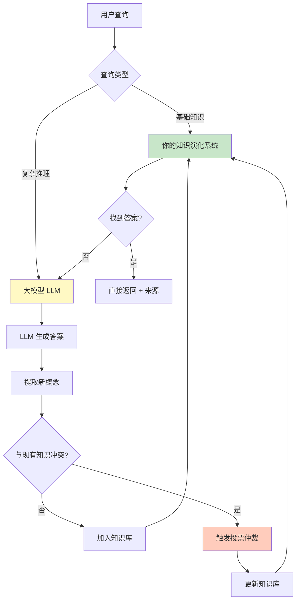
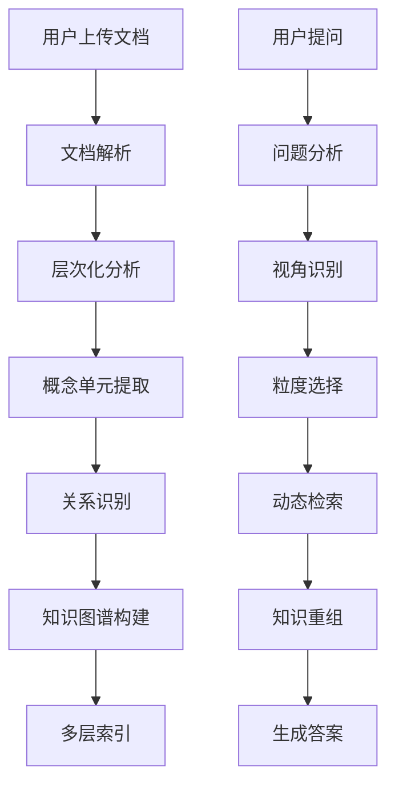
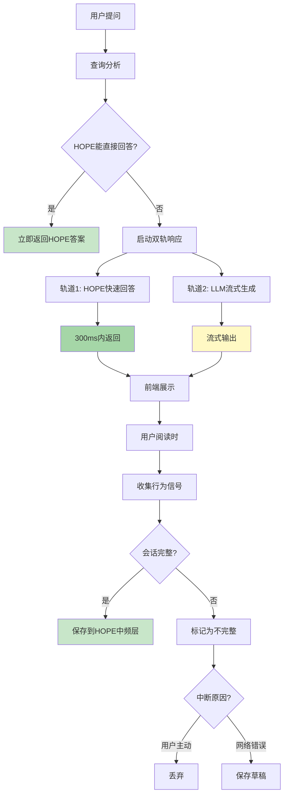

# 层次化语义知识提取与检索系统 (Hierarchical Semantic RAG)

> 文档版本: v1.2  
> 创建日期: 2025-12-08  
> 作者: AI Reviewer Team

---

## 💡 核心洞察

> **"大模型是知识演化后浓缩的数据结构"**

这是一个深刻的类比。大模型（LLM）通过训练，将万亿 tokens 的文本知识压缩到千亿参数中，本质上是一种"有损的统计压缩"。

**但大模型有三个根本缺陷**：
1. **隐式知识** - 无法解释、无法追溯
2. **静态固化** - 训练后无法更新
3. **冲突平均** - 遇到矛盾知识只能模糊处理

**本系统的突破**：
- ✅ **显式知识** - 每个概念可追溯、可解释
- ✅ **动态演化** - 持续更新、投票仲裁
- ✅ **冲突解决** - 显式标记、社区共识

这不是要替代大模型，而是**互补**：
```
大模型 = 通用语言理解 + 创意生成
演化系统 = 精确事实 + 可信知识 + 持续优化
```

**最佳架构**：大模型提供语言能力，演化系统提供事实基础。

### 🚀 第二个关键突破：无感知反馈

> **"用户参与度低是知识演化的最大障碍"**

**传统问题**：
- 点击反馈按钮？用户懒得点（参与率 <1%）
- 填写投票理由？太麻烦（参与率 <0.1%）
- 主动纠错？没有动力（极少数专家）

**本系统的创新**：**正常使用 = 自动反馈**

5种无感知机制：
1. **行为信号分析** - 停留时间、复制动作、返回查看 → 自动推断态度
2. **A/B测试投票** - 冲突概念随机展示 → 用户反应即投票
3. **游戏化激励** - 正常使用获积分 → 自然参与
4. **对话式微反馈** - 10%概率轻量询问 → 简短确认
5. **查询链推断** - 后续问题推断前答案质量

**效果**：
```
参与率: 1% → 95%+
日反馈量: 10 → 1000+
用户负担: 高 → 零
```

### ⚡ 第三个关键突破：双轨流式响应

> **"不要让用户等待，让本地知识先上场"**

**传统问题**：
- 同步等待 LLM 生成（5-30秒白屏）
- 已有的 HOPE 知识未利用
- 中断导致数据丢失

**本系统的创新**：**双轨响应 = HOPE快速答案 + LLM流式生成**

```
轨道1 (快): HOPE 快速答案 <300ms
  ↓
  - 低频层确定答案（置信度 0.9+）
  - 概念库精确定义（健康度 0.8+）
  - 中频层相似问答（评分 4.0+）

轨道2 (全): LLM 流式生成 TTFB <1s
  ↓
  - 检索增强上下文
  - 流式输出（20-50 tokens/s）
  - 可中断、可恢复
```

**三重价值**：

1. **用户体验革命**
   - 300ms 看到快速答案（不觉得慢）
   - 1s 开始看到 LLM 流式输出（有进度感）
   - 边看 HOPE 边等 LLM（无焦虑）

2. **对比学习机制**
   - 用户看到两个答案 → 自然对比
   - 发现 HOPE 不准确 → 点击反馈
   - 系统分析差异 → 自动触发投票
   - 知识持续优化

3. **成本大幅降低**
   - HOPE 能答的不调 LLM（节省 30-40%）
   - 缓存相同问题（命中率 30-40%）
   - 流式中断不浪费（>80%保存草稿）

**效果**：
```
响应时间: 5-30s → 0.3s (HOPE) + 流式
用户跳出率: 30% → 5%
LLM 成本: -30-40%
```

---

## 📖 系统概述

### 核心理念

**传统 RAG 的问题**：
- 扁平化的文档切片，丢失层次结构
- 固定粒度检索，无法适应不同查询视角
- 缺乏语义完整性保证
- **静态知识，无法自我进化** 🆕

**我们的方案**：
- **层次化语义单元提取**：识别概念的最小完整描述
- **多层嵌套知识结构**：保留文档组织关系
- **视角导向检索**：根据问题动态选择知识粒度
- **知识自进化机制**：从初始种子知识到完全自主演化 🆕

### 冷启动问题与解决方案

#### 问题：知识演化的"鸡生蛋"困境

```
困境:
  知识演化需要 → 大量用户反馈
  用户反馈需要 → 足够的知识
  足够的知识需要 → 知识演化
  
  ↓ 死循环 ↓
  
  系统启动时没有知识 → 无法提供服务 → 无用户使用 → 无反馈 → 无法演化
```

#### 解决方案：HOPE 结构驱动的渐进式演化

**HOPE 架构现状**（已实现）：

```java
当前系统的 HOPE 三层结构:

低频层 (PermanentLayerService):
  - 技能模板 (SkillTemplate)
  - 确定性知识 (FactualKnowledge)
  - 特点: 高置信度 (≥0.9)、极少更新、可直接回答
  - 数据: 内置知识 + 专家标注
  
中频层 (OrdinaryLayerService):
  - 近期高分问答 (RecentQA)
  - 特点: 经过验证、定期清理、可晋升到低频层
  - 数据: 用户问答 + 反馈评分
  
高频层 (HighFrequencyLayerService):
  - 会话上下文 (SessionContext)
  - 特点: 短期有效、快速更新、辅助理解
  - 数据: 当前会话的对话历史
```

**集成策略：HOPE → 概念单元库**

```yaml
映射关系:
  HOPE 低频层 → 概念单元库的"种子概念"
    - FactualKnowledge → ConceptUnit (type=DEFINITION)
    - SkillTemplate → ConceptUnit (type=PROCESS)
    - 自动标记: initialSource=HOPE_PERMANENT, confidence=0.95
    
  HOPE 中频层 → 概念单元库的"候选概念"
    - RecentQA (高分) → ConceptUnit (待验证)
    - 条件: 评分≥4.0 + 访问量≥10 + 有效期≥30天
    - 自动标记: initialSource=HOPE_ORDINARY, confidence=0.8
    
  HOPE 高频层 → 不直接引入
    - 理由: 会话级别，不适合作为持久概念
```

**渐进式演化路径**（细化版）：

```yaml
═══════════════════════════════════════════════════════════
阶段 0: 冷启动 (0-7天)
═══════════════════════════════════════════════════════════
数据来源:
  ✅ HOPE 低频层 (PermanentLayer)
  ❌ 用户文档: 暂不引入
  ❌ 用户反馈: 无

引入策略:
  1. 扫描 HOPE 低频层所有知识
  2. 转换为概念单元:
     - FactualKnowledge → 定义型概念
     - SkillTemplate → 流程型概念
  3. 自动设置属性:
     - version: 1
     - status: ACTIVE
     - healthScore: 0.95
     - disputeCount: 0
     - createdBy: "HOPE_SEED"
  
验收标准:
  - 导入概念数量: 100-500个
  - 覆盖领域: 基础定义、通用技能
  - 平均置信度: ≥0.9
  
系统行为:
  - 用户查询直接使用 HOPE 种子概念
  - 无需 LLM 即可回答基础问题
  - 建立知识基线

═══════════════════════════════════════════════════════════
阶段 1: 种子成长 (1-4周)
═══════════════════════════════════════════════════════════
数据来源:
  ✅ HOPE 低频层 (持续)
  ✅ HOPE 中频层 (筛选引入)
  ✅ 用户文档 (开始接收)
  ⚠️ 用户反馈 (收集但不触发演化)

引入策略:
  1. HOPE 中频层筛选条件:
     - 评分 ≥ 4.0 (满分5.0)
     - 访问量 ≥ 10次
     - 存活期 ≥ 30天
     - 无负面反馈
     
  2. 用户文档处理:
     - 提取概念单元
     - 与 HOPE 种子概念对比
     - 冲突检测:
       ✓ 如果与 HOPE 一致 → 直接引入
       ✗ 如果与 HOPE 冲突 → 标记为"待验证"
       
  3. 双轨制管理:
     种子概念 (HOPE来源):
       - confidence ≥ 0.8
       - 优先级高
       - 默认采用
       
     用户概念 (文档来源):
       - confidence = 0.5
       - 优先级低
       - 需要验证

验收标准:
  - HOPE 中频引入: 50-200个
  - 用户文档引入: 100-500个
  - 冲突检测率: ≥95%
  - 种子概念占比: ≥60%

系统行为:
  - 优先返回 HOPE 种子概念
  - 用户概念标注"来源：用户文档"
  - 开始收集反馈数据

═══════════════════════════════════════════════════════════
阶段 2: 混合演化 (1-6个月)
═══════════════════════════════════════════════════════════
数据来源:
  ✅ HOPE 低/中频层 (持续补充)
  ✅ 用户文档 (大量)
  ✅ 用户反馈 (开始驱动演化)

引入策略:
  1. HOPE 角色转变:
     从"主导"变为"参考权威"
     - 低频层: 作为投票时的"专家意见"
     - 中频层: 与用户概念平等竞争
     
  2. 启动投票机制:
     触发条件:
       - 用户概念与 HOPE 概念冲突
       - 用户概念获得10+正向反馈
       - HOPE 概念收到5+质疑
     
     投票权重:
       - HOPE 低频 = 5.0 (专家级)
       - HOPE 中频 = 2.0 (活跃用户级)
       - LLM 评估 = 3.0
       - 普通用户 = 1.0
       
  3. 三方平衡:
     HOPE 概念:
       - 保留权威地位
       - 可被质疑和投票
       
     用户概念:
       - 平等参与竞争
       - 胜出后提升权重
       
     演化概念:
       - 投票胜出的概念
       - 记录演化历史

验收标准:
  - 投票会话数: 10-50个
  - 用户概念胜出率: 20-30%
  - HOPE 概念被更新: 5-10%
  - 知识库增长: +50-100%

系统行为:
  - HOPE 不再绝对权威
  - 用户可以挑战 HOPE 知识
  - 投票决定最终采用版本
  - 形成"HOPE + 社区"共治

═══════════════════════════════════════════════════════════
阶段 3: 自主演化 (6个月+)
═══════════════════════════════════════════════════════════
数据来源:
  ⚠️ HOPE 层 (仅作参考)
  ✅ 用户文档 (主导)
  ✅ 用户反馈 (完全驱动)

引入策略:
  1. HOPE 角色进一步弱化:
     - 仅在"知识空白"时引入新概念
     - 现有概念不再依赖 HOPE
     - HOPE 投票权重降低到 2.0
     
  2. 完全自主投票:
     - 用户 + LLM + 系统自动
     - HOPE 作为"历史记录"参考
     - 社区共识为主导
     
  3. 知识晋升机制:
     用户概念晋升为"权威概念":
       条件:
         - 存活 ≥ 180天
         - 健康度 ≥ 0.9
         - 无争议 ≥ 90天
         - 引用量 ≥ 100次
       
       效果:
         - 权重等同原 HOPE 低频
         - 成为新的"种子概念"
         - 可作为后续判断标准

验收标准:
  - HOPE 依赖度: <20%
  - 用户驱动率: >80%
  - 自主演化概念: >60%
  - 晋升权威概念: 10-50个

系统行为:
  - 完全自主运作
  - HOPE 成为"历史档案"
  - 形成自己的知识权威体系
  - 持续自我优化
```

### 🧠 理论基础：大模型 vs 知识演化系统

#### 大模型是什么？

**是的，大模型可以看作"知识演化后浓缩的数据结构"**，但更准确地说：

```yaml
大模型 (LLM) = 海量知识的统计压缩 + 模式识别能力

本质:
  训练过程:
    - 输入: 数万亿 tokens 的文本数据（互联网、书籍、代码等）
    - 过程: 通过反向传播学习词语之间的统计关系
    - 输出: 数十亿/千亿参数的神经网络权重
  
  可以类比为:
    "人类文明知识的有损压缩编码"
    - 压缩比: 1TB 文本 → 100GB 模型（10:1）
    - 损失: 具体事实、精确数字、最新信息
    - 保留: 语言模式、知识关联、推理能力

知识表示形式:
  - 隐式: 知识分布在数十亿参数中
  - 不可解释: 无法指出"Docker的定义在哪个参数"
  - 模糊边界: 概念之间的界限是渐变的
  - 静态: 训练完成后知识固定（除非重新训练）
```

#### 对比：大模型 vs 你的知识演化系统

| 维度 | 大模型 (LLM) | 你的知识演化系统 |
|------|-------------|-----------------|
| **知识表示** | 隐式（参数权重） | 显式（概念单元+关系图） |
| **可解释性** | ❌ 黑盒 | ✅ 每个概念可追溯 |
| **知识更新** | ❌ 需重新训练（成本高） | ✅ 增量更新、投票演化 |
| **知识来源** | ❌ 无法追溯 | ✅ 明确标记来源 |
| **冲突处理** | ❌ 训练时隐式平均 | ✅ 显式投票仲裁 |
| **精确性** | ⚠️ 模糊、可能幻觉 | ✅ 高置信度知识可直接回答 |
| **规模** | 🔥 TB级数据 → GB级模型 | 📦 GB级数据 → GB级知识库 |
| **成本** | 💰 训练：百万美元 | 💵 运行：千元级别 |
| **演化方式** | 预训练 → 微调 → 再训练 | 持续演化、实时更新 |
| **用户参与** | ❌ 被动使用 | ✅ 主动共建 |

#### 为什么大模型不能完全替代你的系统？

**问题 1：知识时效性**
```
大模型:
  GPT-4 (2023训练) → 不知道2024年的技术变化
  解决方案: RAG（检索增强生成）← 这就是你的系统！

你的系统:
  2024年文档上传 → 立即可用
  概念冲突 → 投票更新 → 知识演化
```

**问题 2：领域专业性**
```
大模型:
  通用知识强，但企业内部知识、行业术语可能不准确
  
你的系统:
  HOPE 低频层 = 企业专家认证的权威知识
  用户反馈 = 领域专家的持续纠正
  → 形成"领域专用知识库"
```

**问题 3：可信度与溯源**
```
大模型:
  回答: "Docker 是容器化平台"
  来源: ❓ 未知（可能来自千万个网页的综合）
  
你的系统:
  回答: "Docker 是容器化平台"
  来源: ✅ HOPE 低频层 → FactualKnowledge #123
         由专家 John 标注，置信度 0.95
         最后验证: 2024-12-01
         10 次用户确认，0 次质疑
```

**问题 4：冲突与歧义**
```
大模型:
  遇到冲突知识 → 隐式平均 → 可能产生混乱的回答
  
你的系统:
  遇到冲突知识 → 显式标记 → 投票仲裁 → 胜出概念
  用户可见: "此概念存在 2 个版本，当前采用版本 2（投票胜出）"
```

#### 两者的互补关系

**最佳实践：LLM + 知识演化系统**



**角色分工**：

| 任务 | 负责方 | 理由 |
|------|--------|------|
| **定义查询** | 知识库优先 | 精确、可溯源、高置信度 |
| **对比分析** | LLM + 知识库 | LLM 生成框架，知识库提供事实 |
| **创意生成** | LLM | 需要想象力和语言能力 |
| **领域推理** | 知识库 + LLM | 知识库提供专业知识，LLM 推理 |
| **实时更新** | 知识库 | LLM 无法实时更新 |
| **冲突解决** | 知识库 | LLM 无冲突处理机制 |

#### 知识演化系统的独特价值

**大模型做不到的 5 件事**：

```yaml
1. 实时知识更新:
   场景: 2024-12-08 发布新版本 React 19
   大模型: ❌ 需要等待下次训练（可能1年后）
   你的系统: ✅ 上传文档 → 立即可用

2. 知识溯源:
   场景: "这个答案的来源是什么？"
   大模型: ❌ 无法回答
   你的系统: ✅ 文档X第Y页，专家Z标注，置信度0.95

3. 冲突协商:
   场景: 文档A说X好，文档B说Y好
   大模型: ❌ 模糊回答或产生幻觉
   你的系统: ✅ 显示两种观点 + 投票结果 + 社区共识

4. 用户共建:
   场景: 用户发现错误
   大模型: ❌ 无法修正（需要OpenAI重新训练）
   你的系统: ✅ 点击"质疑" → 触发重审 → 社区投票 → 更新

5. 知识权威化:
   场景: 形成行业标准知识库
   大模型: ❌ 通用知识，不够权威
   你的系统: ✅ 专家认证 + 社区验证 → 领域权威
```

#### 理论总结：知识的三种形态

```yaml
形态1_隐式知识 (大模型):
  载体: 神经网络参数
  优点: 泛化能力强、语言能力强
  缺点: 不可解释、无法更新、可能幻觉
  适用: 通用任务、创意生成

形态2_显式知识 (传统数据库):
  载体: 结构化数据（表格、JSON）
  优点: 精确、可查询
  缺点: 缺乏语义理解、难以推理
  适用: 事实查询、数据分析

形态3_演化知识 (你的系统):
  载��: 概念单元 + 关系图 + 版本历史
  优点: 可解释、可演化、可溯源、语义理解
  缺点: 初期需要种子知识、需要社区参与
  适用: 领域知识库��企业知识管理、专业问答
```

**未来趋势**：三者融合

```
理想的 AI 系统 = 大模型的语言能力 
                + 数据库的精确性 
                + 知识演化的可信度
                
实现路径:
  1. 大模型作为"语言理解引擎"
  2. 知识演化系统作为"事实核心"
  3. 传统数据库作为"数据底座"
  
你的系统正在走向这个方向！
```

---

### 关键概念

```yaml
概念单元 (Concept Unit):
  定义: 一个独立、完整的语义最小单位
  特征:
    - 自包含：脱离上下文仍可理解
    - 完整性：包含概念的核心要素
    - 原子性：不可再分割而不失去意义
  
  示例:
    文本: "Docker 是一个容器化平台，允许开发者将应用及其依赖打包成轻量级、可移植的容器"
    概念单元:
      - name: "Docker"
      - type: "技术平台"
      - definition: "容器化平台"
      - features: ["打包应用", "包含依赖", "轻量级", "可移植"]
      - purpose: "简化应用部署"
```

---

## 🏗️ 系统架构

### 整体流程



### 核心模块

```
┌─────────────────────────────────────────────────────────────┐
│                    索引阶段 (Indexing Phase)                 │
├─────────────────────────────────────────────────────────────┤
│  1. 文档解析器 (DocumentParser)                             │
│     - 识别文档结构 (标题、段落、列表...)                     │
│     - 提取元数据 (作者、时间、主题...)                       │
│                                                              │
│  2. 层次分析器 (HierarchyAnalyzer)                          │
│     - 识别概念层级                                           │
│     - 构建文档树结构                                         │
│                                                              │
│  3. 概念提取器 (ConceptExtractor)                           │
│     - 识别最小语义单元                                       │
│     - 提取概念属性 (定义、特征、示例...)                     │
│                                                              │
│  4. 关系识别器 (RelationIdentifier)                         │
│     - 概念内关系 (属性关联)                                  │
│     - 概念间关系 (依赖、对比、继承...)                       │
│     - 跨文档关系 (引用、扩展、矛盾...)                       │
│                                                              │
│  5. 知识存储器 (KnowledgeStore)                             │
│     - 层次化存储结构                                         │
│     - 多粒度索引                                             │
│     - 关系图谱                                               │
└─────────────────────────────────────────────────────────────┘

┌─────────────────────────────────────────────────────────────┐
│                    演化阶段 (Evolution Phase) 🆕             │
├─────────────────────────────────────────────────────────────┤
│  1. 反馈收集器 (FeedbackCollector)                          │
│     - 用户显式反馈（点赞/点踩/评论）                         │
│     - 隐式行为分析（停留时间、跳过率）                       │
│     - 专家审核标注                                           │
│                                                              │
│  2. 冲突检测器 (ConflictDetector)                           │
│     - 识别矛盾概念（相同名称不同定义）                       │
│     - 检测过时信息（基于时间戳）                             │
│     - 发现不一致性（跨文档对比）                             │
│                                                              │
│  3. 投票仲裁器 (VotingArbiter)                              │
│     - 多源投票机制（用户、专家、模型）                       │
│     - 加权评分系统                                           │
│     - 争议阈值判断                                           │
│                                                              │
│  4. 概念更新器 (ConceptUpdater)                             │
│     - 版本管理（保留历史版本）                               │
│     - 增量修正（部分更新）                                   │
│     - 影响传播（更新相关概念）                               │
│                                                              │
│  5. 质量监控器 (QualityMonitor)                             │
│     - 概念健康度评分                                         │
│     - 争议度追踪                                             │
│     - 自动触发重审                                           │
└─────────────────────────────────────────────────────────────┘

┌─────────────────────────────────────────────────────────────┐
│                    检索阶段 (Retrieval Phase)                │
├─────────────────────────────────────────────────────────────┤
│  1. 问题分析器 (QueryAnalyzer)                              │
│     - 意图识别 (定义查询、对比查询、实操查询...)             │
│     - 视角识别 (概念层、实现层、应用层...)                   │
│     - 粒度需求 (最小单元、章节级、文档级...)                 │
│                                                              │
│  2. 检索策略器 (RetrievalStrategy)                          │
│     - 单点深入 (Single Concept Deep Dive)                   │
│     - 横向对比 (Horizontal Comparison)                      │
│     - 纵向追溯 (Vertical Tracing)                           │
│     - 网络扩散 (Network Expansion)                          │
│                                                              │
│  3. 知识重组器 (KnowledgeReorganizer)                       │
│     - 按问题视角重组知识                                     │
│     - 补全缺失的上下文                                       │
│     - 生成结构化答案                                         │
└─────────────────────────────────────────────────────────────┘
```

---

## 🔍 概念单元提取 (Concept Extraction)

### 提取策略

#### 1. 基于 LLM 的语义分割

**Prompt 设计**：

```
你是一个知识提取专家。请从以下文档片段中提取所有独立的概念单元。

文档片段：
{text}

提取要求：
1. 每个概念单元必须是完整的、自包含的
2. 提取概念的核心要素：名称、定义、特征、示例、关系
3. 识别概念的层级关系（父概念、子概念）

输出格式（JSON）：
{
  "concepts": [
    {
      "id": "concept_001",
      "name": "概念名称",
      "type": "概念类型（技术/流程/原理/工具...）",
      "definition": "核心定义",
      "attributes": {
        "features": ["特征1", "特征2"],
        "examples": ["示例1"],
        "use_cases": ["应用场景1"]
      },
      "relations": {
        "parent": "父概念ID",
        "children": ["子概念ID"],
        "related": ["相关概念ID"],
        "depends_on": ["依赖概念ID"]
      },
      "context": {
        "section": "所属章节",
        "importance": 0.9,
        "completeness": "完整|部分|引用"
      }
    }
  ]
}
```

#### 2. 渐进式细化

```java
public class ConceptExtractor {
    
    private final LLMClient llmClient;
    
    /**
     * 多轮提取：从粗到细
     */
    public List<Concept> extract(String documentContent) {
        // 第一轮：识别主要概念（章节级）
        List<Concept> mainConcepts = extractMainConcepts(documentContent);
        
        // 第二轮：细化每个主要概念
        for (Concept concept : mainConcepts) {
            List<Concept> subConcepts = extractSubConcepts(concept);
            concept.setChildren(subConcepts);
        }
        
        // 第三轮：提取概念属性
        for (Concept concept : getAllConcepts(mainConcepts)) {
            extractAttributes(concept);
        }
        
        // 第四轮：识别关系
        identifyRelations(mainConcepts);
        
        return mainConcepts;
    }
    
    /**
     * 提取最小语义单元
     */
    private List<Concept> extractSubConcepts(Concept parentConcept) {
        String prompt = String.format("""
            从以下概念描述中提取最小的独立概念单元：
            
            概念：%s
            描述：%s
            
            要求：
            1. 每个单元可以独立理解
            2. 保持语义完整性
            3. 标注与父概念的关系
            """, parentConcept.getName(), parentConcept.getContent());
        
        String response = llmClient.chat(prompt);
        return parseConceptsFromJson(response);
    }
}
```

---

## 📊 层次化知识结构

### 存储模型

```java
/**
 * 概念单元数据模型
 */
@Data
public class ConceptUnit {
    
    // 基本信息
    private String id;                    // 唯一标识
    private String name;                  // 概念名称
    private ConceptType type;             // 类型
    private int level;                    // 层级（0=文档，1=章节，2=概念，3=子概念...）
    
    // 语义信息
    private String definition;            // 核心定义
    private String description;           // 详细描述
    private List<String> keywords;        // 关键词
    private List<String> examples;        // 示例
    
    // 层次关系
    private String parentId;              // 父概念
    private List<String> childrenIds;     // 子概念
    private int depth;                    // 深度
    
    // 横向关系
    private List<Relation> relations;     // 与其他概念的关系
    
    // 上下文信息
    private String sourceDocument;        // 来源文档
    private String section;               // 所属章节
    private int position;                 // 文档中的位置
    
    // 质量评分
    private double completeness;          // 完整性 (0-1)
    private double independence;          // 独立性 (0-1)
    private double importance;            // 重要性 (0-1)
    
    // 向量表示
    private float[] embedding;            // 语义向量
    
    // 🆕 演化相关字段
    private int version;                  // 当前版本号
    private LocalDateTime createdAt;      // 创建时间
    private LocalDateTime updatedAt;      // 最后更新时间
    private int disputeCount;             // 争议次数
    private double healthScore;           // 健康度评分
    private String currentVotingSessionId; // 当前投票会话ID（如果正在投票中）
    
    // 元数据
    private Map<String, Object> metadata;
}

/**
 * 概念关系
 */
@Data
public class Relation {
    private String targetId;              // 目标概念
    private RelationType type;            // 关系类型
    private double strength;              // 关系强度
    private String description;           // 关系描述
}

enum RelationType {
    IS_A,           // 是一种
    PART_OF,        // 是...的一部分
    DEPENDS_ON,     // 依赖于
    SIMILAR_TO,     // 类似于
    OPPOSITE_TO,    // 相对于
    IMPLEMENTS,     // 实现
    EXTENDS,        // 扩展
    USES,           // 使用
    RELATED_TO      // 相关
}
```

---

## ⚙️ 系统配置 (application.yml)

### 知识演化配置

```yaml
knowledge:
  evolution:
    # 当前演化阶段（控制系统行为）
    current-stage: BOOTSTRAP  # BOOTSTRAP | SEED_GROWTH | MIXED_EVOLUTION | AUTONOMOUS
    
    # HOPE 集成配置
    hope-integration:
      enabled: true
      
      # 冷启动配置
      bootstrap:
        enabled: true
        import-permanent-layer: true    # 导入 HOPE 低频层
        import-ordinary-layer: false    # 暂不导入中频层
        min-confidence: 0.8             # 最低置信度
        
      # 种子成长配置
      seed-growth:
        enabled: false                  # 阶段0完成后启用
        ordinary-filter:
          min-rating: 4.0
          min-access-count: 10
          min-days-alive: 30
          require-no-negative: true
        
      # 投票参与配置
      voting-participation:
        permanent-layer-weight: 5.0     # HOPE 低频层投票权重
        ordinary-layer-weight: 2.0      # HOPE 中频层投票权重
    
    # 概念来源优先级（根据阶段自动调整）
    source-priority:
      hope-permanent: 8.0     # 阶段1权重
      hope-ordinary: 6.0
      user-document: 3.0
      community-evolved: 5.0
      community-authority: 10.0
    
    # 反馈收集
    feedback:
      enabled: true
      collect-implicit: true              # 收集隐式反馈
      implicit-dwell-threshold: 30        # 停留时间阈值（秒）
      
    # 冲突检测
    conflict-detection:
      enabled: true
      similarity-threshold: 0.8           # 概念相似度阈值
      auto-detect-on-import: true         # 导入时自动检测
      
    # 投票仲裁
    voting:
      enabled: false                      # 阶段2后启用
      voting-period-days: 7               # 投票周期
      min-votes-required: 5               # 最少投票数
      auto-close-threshold: 20            # 自动结束票数
      
      weights:
        expert-user: 5.0
        llm-evaluation: 3.0
        active-user: 2.0
        system-auto: 1.5
        normal-user: 1.0
    
    # 质量监控
    quality-monitor:
      enabled: true
      check-interval-hours: 24            # 检查间隔
      
      # 重审触发条件
      review-triggers:
        dispute-threshold: 5              # 争议次数阈值
        health-score-threshold: 0.5       # 健康度阈值
        negative-rate-threshold: 0.3      # 负面反馈率阈值
        min-feedback-count: 10            # 最少反馈数
    
    # 版本管理
    versioning:
      enabled: true
      max-versions-per-concept: 10        # 最多保留版本数
      archive-after-days: 365             # 归档时间
      
    # 知识晋升（阶段3）
    knowledge-promotion:
      enabled: false                      # 阶段3启用
      conditions:
        min-days-alive: 180
        min-health-score: 0.9
        min-no-dispute-days: 90
        min-reference-count: 100
```

### 阶段切换示例

```yaml
# 阶段0 → 阶段1 切换配置
阶段0完成后:
  1. 修改 current-stage: SEED_GROWTH
  2. 启用 hope-integration.seed-growth.enabled: true
  3. 观察1-2周，收集反馈数据
  
阶段1 → 阶段2 切换配置:
  1. 修改 current-stage: MIXED_EVOLUTION
  2. 启用 voting.enabled: true
  3. 调整 source-priority 权重
  4. 观察投票效果
  
阶段2 → 阶段3 切换配置:
  1. 修改 current-stage: AUTONOMOUS
  2. 启用 knowledge-promotion.enabled: true
  3. 降低 HOPE 权重
  4. 系统自主运行
```

### 多层索引

```java
/**
 * 多层知识索引
 */
public class HierarchicalKnowledgeIndex {
    
    // 层级索引：按层级组织概念
    private Map<Integer, List<ConceptUnit>> levelIndex;
    
    // 类型索引：按类型组织概念
    private Map<ConceptType, List<ConceptUnit>> typeIndex;
    
    // 向量索引：语义相似度检索
    private VectorIndex vectorIndex;
    
    // 关系图：概念关系网络
    private Graph<ConceptUnit, Relation> relationGraph;
    
    // 文档树：保留原始文档结构
    private Map<String, ConceptTree> documentTrees;
    
    /**
     * 按粒度检索
     */
    public List<ConceptUnit> searchByGranularity(String query, int targetLevel) {
        // 先进行语义检索
        List<ConceptUnit> candidates = vectorIndex.search(query);
        
        // 筛选目标层级的概念
        return candidates.stream()
            .filter(c -> c.getLevel() == targetLevel)
            .collect(Collectors.toList());
    }
    
    /**
     * 向上追溯：获取完整上下文
     */
    public List<ConceptUnit> traceUp(ConceptUnit concept) {
        List<ConceptUnit> path = new ArrayList<>();
        ConceptUnit current = concept;
        
        while (current.getParentId() != null) {
            current = getConceptById(current.getParentId());
            path.add(0, current);  // 添加到路径开头
        }
        
        return path;
    }
    
    /**
     * 向下展开：获取所有子概念
     */
    public List<ConceptUnit> expandDown(ConceptUnit concept, int maxDepth) {
        List<ConceptUnit> result = new ArrayList<>();
        expandRecursive(concept, maxDepth, 0, result);
        return result;
    }
    
    /**
     * 横向扩展：获取相关概念
     */
    public List<ConceptUnit> expandHorizontal(ConceptUnit concept, int maxHops) {
        // 使用图遍历算法（BFS）
        return relationGraph.bfs(concept, maxHops);
    }
}
```

---

## 🎯 视角导向检索 (Perspective-Oriented Retrieval)

### 问题视角分类

```yaml
视角类型:
  1. 定义视角 (Definition):
      问题: "什么是X？"
      检索策略: 单点深入 → 获取概念核心定义
      粒度: 最小概念单元
      
  2. 实现视角 (Implementation):
      问题: "X如何实现？"
      检索策略: 纵向追溯 → 获取实现细节
      粒度: 子概念 + 示例
      
  3. 对比视角 (Comparison):
      问题: "X和Y有什么区别？"
      检索策略: 横向对比 → 获取多个概念
      粒度: 同级概念单元
      
  4. 应用视角 (Application):
      问题: "X有什么用？"
      检索策略: 网络扩散 → 获取应用场景
      粒度: 关联概念 + 用例
      
  5. 全局视角 (Holistic):
      问题: "整体架构是什么？"
      检索策略: 树状展开 → 获取完整层次
      粒度: 文档级 + 章节级
```

### 检索策略实现

```java
/**
 * 视角导向检索器
 */
public class PerspectiveOrientedRetriever {
    
    private final HierarchicalKnowledgeIndex index;
    private final LLMClient llmClient;
    
    /**
     * 主检索接口
     */
    public RetrievalResult retrieve(String question) {
        // 1. 分析问题视角
        Perspective perspective = analyzePerspective(question);
        
        // 2. 选择检索策略
        RetrievalStrategy strategy = selectStrategy(perspective);
        
        // 3. 执行检索
        List<ConceptUnit> concepts = strategy.search(question, index);
        
        // 4. 知识重组
        return reorganizeKnowledge(concepts, perspective);
    }
    
    /**
     * 分析问题视角
     */
    private Perspective analyzePerspective(String question) {
        String prompt = String.format("""
            分析以下问题的视角类型：
            
            问题：%s
            
            视角类型：
            - definition: 询问定义/概念
            - implementation: 询问实现/方法
            - comparison: 询问对比/区别
            - application: 询问应用/用途
            - holistic: 询问整体/架构
            - causal: 询问因果/原理
            
            返回：视角类型 + 关键实体 + 所需粒度
            """, question);
        
        String response = llmClient.chat(prompt);
        return parsePerspective(response);
    }
    
    /**
     * 策略：单点深入
     */
    private class SingleConceptDeepDive implements RetrievalStrategy {
        @Override
        public List<ConceptUnit> search(String question, HierarchicalKnowledgeIndex index) {
            // 1. 识别目标概念
            String conceptName = extractConceptName(question);
            
            // 2. 找到最相关的概念单元
            ConceptUnit mainConcept = index.searchByName(conceptName).get(0);
            
            // 3. 获取完整定义（向上追溯获取上下文）
            List<ConceptUnit> context = index.traceUp(mainConcept);
            
            // 4. 获取核心属性（当前层级的完整信息）
            List<ConceptUnit> result = new ArrayList<>(context);
            result.add(mainConcept);
            
            return result;
        }
    }
    
    /**
     * 策略：横向对比
     */
    private class HorizontalComparison implements RetrievalStrategy {
        @Override
        public List<ConceptUnit> search(String question, HierarchicalKnowledgeIndex index) {
            // 1. 识别对比的两个（或多个）概念
            List<String> conceptNames = extractComparisonTargets(question);
            
            // 2. 获取同一层级的概念单元
            List<ConceptUnit> concepts = conceptNames.stream()
                .map(name -> index.searchByName(name).get(0))
                .collect(Collectors.toList());
            
            // 3. 获取共同的父概念（提供对比框架）
            ConceptUnit commonParent = findCommonParent(concepts);
            
            // 4. 组织对比结构
            List<ConceptUnit> result = new ArrayList<>();
            result.add(commonParent);  // 对比框架
            result.addAll(concepts);   // 被对比的概念
            
            return result;
        }
    }
    
    /**
     * 策略：纵向追溯
     */
    private class VerticalTracing implements RetrievalStrategy {
        @Override
        public List<ConceptUnit> search(String question, HierarchicalKnowledgeIndex index) {
            // 1. 识别起始概念
            String conceptName = extractConceptName(question);
            ConceptUnit startConcept = index.searchByName(conceptName).get(0);
            
            // 2. 向上追溯（获取定义和背景）
            List<ConceptUnit> upContext = index.traceUp(startConcept);
            
            // 3. 向下展开（获取实现细节）
            List<ConceptUnit> downDetails = index.expandDown(startConcept, 2);
            
            // 4. 组合完整路径
            List<ConceptUnit> result = new ArrayList<>(upContext);
            result.add(startConcept);
            result.addAll(downDetails);
            
            return result;
        }
    }
    
    /**
     * 策略：网络扩散
     */
    private class NetworkExpansion implements RetrievalStrategy {
        @Override
        public List<ConceptUnit> search(String question, HierarchicalKnowledgeIndex index) {
            // 1. 识别中心概念
            String conceptName = extractConceptName(question);
            ConceptUnit centerConcept = index.searchByName(conceptName).get(0);
            
            // 2. 横向扩展（获取相关概念）
            List<ConceptUnit> relatedConcepts = index.expandHorizontal(centerConcept, 2);
            
            // 3. 按关系强度排序
            relatedConcepts.sort((a, b) -> 
                Double.compare(getRelationStrength(centerConcept, b),
                             getRelationStrength(centerConcept, a)));
            
            // 4. 组织关系网络
            List<ConceptUnit> result = new ArrayList<>();
            result.add(centerConcept);       // 中心
            result.addAll(relatedConcepts);  // 相关概念
            
            return result;
        }
    }
}
```

---

## 🔄 知识重组 (Knowledge Reorganization)

### 按视角重组知识

```java
/**
 * 知识重组器
 */
public class KnowledgeReorganizer {
    
    /**
     * 根据问题视角重组知识
     */
    public StructuredAnswer reorganize(List<ConceptUnit> concepts, Perspective perspective) {
        return switch (perspective.getType()) {
            case DEFINITION -> buildDefinitionAnswer(concepts);
            case IMPLEMENTATION -> buildImplementationAnswer(concepts);
            case COMPARISON -> buildComparisonAnswer(concepts);
            case APPLICATION -> buildApplicationAnswer(concepts);
            case HOLISTIC -> buildHolisticAnswer(concepts);
        };
    }
    
    /**
     * 构建定义型答案
     */
    private StructuredAnswer buildDefinitionAnswer(List<ConceptUnit> concepts) {
        ConceptUnit mainConcept = findMainConcept(concepts);
        
        return StructuredAnswer.builder()
            .structure("definition")
            .sections(List.of(
                Section.of("核心定义", mainConcept.getDefinition()),
                Section.of("关键特征", formatFeatures(mainConcept)),
                Section.of("典型示例", formatExamples(mainConcept)),
                Section.of("相关概念", formatRelations(mainConcept))
            ))
            .build();
    }
    
    /**
     * 构建对比型答案
     */
    private StructuredAnswer buildComparisonAnswer(List<ConceptUnit> concepts) {
        ConceptUnit parent = concepts.get(0);  // 对比框架
        List<ConceptUnit> targets = concepts.subList(1, concepts.size());
        
        // 提取对比维度
        List<String> dimensions = extractComparisonDimensions(targets);
        
        // 构建对比表格
        ComparisonTable table = new ComparisonTable();
        table.setColumns(targets.stream().map(ConceptUnit::getName).toList());
        table.setRows(dimensions);
        
        for (String dimension : dimensions) {
            List<String> values = targets.stream()
                .map(c -> extractDimensionValue(c, dimension))
                .toList();
            table.addRow(dimension, values);
        }
        
        return StructuredAnswer.builder()
            .structure("comparison")
            .sections(List.of(
                Section.of("对比框架", parent.getDescription()),
                Section.of("对比分析", table.toMarkdown()),
                Section.of("总结", generateComparisonSummary(targets, dimensions))
            ))
            .build();
    }
    
    /**
     * 构建实现型答案
     */
    private StructuredAnswer buildImplementationAnswer(List<ConceptUnit> concepts) {
        // 按层级排序（从抽象到具体）
        concepts.sort(Comparator.comparingInt(ConceptUnit::getLevel));
        
        List<Section> sections = new ArrayList<>();
        
        // 1. 整体概述（高层概念）
        sections.add(Section.of("概述", concepts.get(0).getDescription()));
        
        // 2. 实现步骤（中层概念）
        List<ConceptUnit> steps = concepts.stream()
            .filter(c -> c.getType() == ConceptType.PROCESS)
            .toList();
        sections.add(Section.of("实现步骤", formatSteps(steps)));
        
        // 3. 技术细节（底层概念）
        List<ConceptUnit> details = concepts.stream()
            .filter(c -> c.getLevel() == concepts.get(concepts.size()-1).getLevel())
            .toList();
        sections.add(Section.of("技术细节", formatDetails(details)));
        
        // 4. 示例代码
        List<String> examples = concepts.stream()
            .flatMap(c -> c.getExamples().stream())
            .toList();
        sections.add(Section.of("代码示例", String.join("\n\n", examples)));
        
        return StructuredAnswer.builder()
            .structure("implementation")
            .sections(sections)
            .build();
    }
}
```

---

## ⚡ 流式响应与性能优化

### 核心问题

**问题1：响应延迟高**
```yaml
传统同步模式:
  用户提问 
    ↓ 等待...
  检索文档 (200ms)
    ↓ 等待...
  LLM生成 (5-30秒)
    ↓ 等待...
  返回完整答案
  
用户体验:
  - 长时间白屏
  - 无进度提示
  - 焦虑等待
  - 容易离开
```

**问题2：中断导致数据丢失**
```yaml
流式响应中断:
  生成到一半 → 用户刷新 → 回答丢失
  
影响:
  - 无法收集隐式反馈（停留时间、阅读行为）
  - HOPE 学习失败
  - 资源浪费（已生成内容丢失）
```

**问题3：在线模型依赖**
```yaml
每次都调用在线模型:
  - 成本高（每次查询消耗 tokens）
  - 延迟高（网络 + 生成时间）
  - 稳定性差（依赖外部服务）
  
已有知识未利用:
  - HOPE 低频层有确定答案
  - 概念库有精确定义
  - 浪费了本地知识
```

---

### 解决方案：混合流式响应架构



---

### 1. 流式响应架构

#### 1.1 后端：双轨响应系统

```java
/**
 * 混合流式响应服务
 * 同时提供 HOPE 快速答案和 LLM 流式生成
 */
@Service
public class HybridStreamingService {
    
    private final HOPEKnowledgeManager hopeManager;
    private final LLMClient llmClient;
    private final ConceptIndex conceptIndex;
    
    /**
     * 核心方法：双轨响应
     */
    public StreamingResponse ask(String question, String sessionId) {
        long startTime = System.currentTimeMillis();
        
        // 1. 快速查询 HOPE（目标 <300ms）
        CompletableFuture<HOPEAnswer> hopeFuture = CompletableFuture.supplyAsync(() -> {
            try {
                return queryHOPEFast(question, sessionId);
            } catch (Exception e) {
                log.warn("HOPE 快速查询失败: {}", e.getMessage());
                return null;
            }
        });
        
        // 2. 启动 LLM 流式生成
        StreamingSession llmSession = startLLMStreaming(question, sessionId);
        
        // 3. 创建响应对象
        StreamingResponse response = new StreamingResponse(
            sessionId,
            question,
            hopeFuture,
            llmSession
        );
        
        log.info("🚀 启动双轨响应：会话={}, 耗时={}ms", 
            sessionId, System.currentTimeMillis() - startTime);
        
        return response;
    }
    
    /**
     * HOPE 快速查询（优化后 <300ms）
     */
    private HOPEAnswer queryHOPEFast(String question, String sessionId) {
        long startTime = System.currentTimeMillis();
        
        // 优先级1：低频层确定性知识（最快）
        FactualKnowledge fact = hopeManager.getPermanentLayer()
            .findDirectAnswer(question);
        
        if (fact != null && fact.getConfidence() >= 0.9) {
            return HOPEAnswer.builder()
                .answer(fact.getAnswer())
                .confidence(fact.getConfidence())
                .source("HOPE_PERMANENT")
                .canDirectAnswer(true)
                .responseTime(System.currentTimeMillis() - startTime)
                .build();
        }
        
        // 优先级2：概念单元库（次快）
        List<ConceptUnit> concepts = conceptIndex.quickSearch(question, 3);
        if (!concepts.isEmpty() && concepts.get(0).getHealthScore() >= 0.8) {
            ConceptUnit bestConcept = concepts.get(0);
            
            String answer = formatConceptAsAnswer(bestConcept);
            
            return HOPEAnswer.builder()
                .answer(answer)
                .confidence(bestConcept.getHealthScore())
                .source("CONCEPT_LIBRARY")
                .conceptId(bestConcept.getId())
                .canDirectAnswer(true)
                .responseTime(System.currentTimeMillis() - startTime)
                .relatedConcepts(concepts.subList(1, Math.min(3, concepts.size())))
                .build();
        }
        
        // 优先级3：中频层近期问答
        RecentQA recentQA = hopeManager.getOrdinaryLayer()
            .findSimilarQA(question, 0.85);
        
        if (recentQA != null && recentQA.getRating() >= 4.0) {
            return HOPEAnswer.builder()
                .answer(recentQA.getAnswer())
                .confidence(recentQA.getRating() / 5.0)
                .source("HOPE_ORDINARY")
                .canDirectAnswer(false)  // 相似度不是100%
                .responseTime(System.currentTimeMillis() - startTime)
                .similarityScore(recentQA.getSimilarityScore())
                .build();
        }
        
        // 无法快速回答
        return HOPEAnswer.builder()
            .canDirectAnswer(false)
            .source("NONE")
            .responseTime(System.currentTimeMillis() - startTime)
            .build();
    }
    
    /**
     * 启动 LLM 流式生成
     */
    private StreamingSession startLLMStreaming(String question, String sessionId) {
        StreamingSession session = new StreamingSession(sessionId, question);
        
        // 异步启动流式生成
        CompletableFuture.runAsync(() -> {
            try {
                // 检索增强
                List<Document> docs = retrieveDocuments(question);
                String context = buildContext(docs);
                
                // 流式调用 LLM
                llmClient.streamChat(
                    question, 
                    context,
                    chunk -> {
                        // 每个 chunk 到达时
                        session.appendChunk(chunk);
                        session.notifySubscribers(chunk);
                    },
                    () -> {
                        // 完成时
                        session.markComplete();
                        
                        // 异步保存到 HOPE
                        saveToHOPEAsync(session);
                    },
                    error -> {
                        // 错误时
                        session.markError(error);
                    }
                );
                
            } catch (Exception e) {
                log.error("LLM 流式生成失败: {}", e.getMessage(), e);
                session.markError(e);
            }
        });
        
        return session;
    }
}

/**
 * 流式会话
 */
@Data
public class StreamingSession {
    private String sessionId;
    private String question;
    private StringBuilder fullAnswer = new StringBuilder();
    private List<Consumer<String>> subscribers = new ArrayList<>();
    
    private SessionStatus status = SessionStatus.STREAMING;
    private LocalDateTime startTime = LocalDateTime.now();
    private LocalDateTime completeTime;
    
    // 中断容错
    private boolean interrupted = false;
    private String interruptReason;
    private int chunksReceived = 0;
    private int totalChunks = -1;  // -1 表示未知
    
    public void appendChunk(String chunk) {
        fullAnswer.append(chunk);
        chunksReceived++;
    }
    
    public void notifySubscribers(String chunk) {
        for (Consumer<String> subscriber : subscribers) {
            try {
                subscriber.accept(chunk);
            } catch (Exception e) {
                log.warn("通知订阅者失败: {}", e.getMessage());
            }
        }
    }
    
    public void markComplete() {
        this.status = SessionStatus.COMPLETED;
        this.completeTime = LocalDateTime.now();
    }
    
    public void markInterrupted(String reason) {
        this.interrupted = true;
        this.interruptReason = reason;
        this.status = SessionStatus.INTERRUPTED;
    }
    
    public boolean isValid() {
        // 判断会话是否有效（用于 HOPE 学习）
        if (status != SessionStatus.COMPLETED) return false;
        if (fullAnswer.length() < 50) return false;  // 太短
        if (getDurationSeconds() < 2) return false;  // 太快（可能是错误）
        return true;
    }
    
    public long getDurationSeconds() {
        LocalDateTime end = completeTime != null ? completeTime : LocalDateTime.now();
        return Duration.between(startTime, end).getSeconds();
    }
}

enum SessionStatus {
    STREAMING,      // 正在流式输出
    COMPLETED,      // 完成
    INTERRUPTED,    // 中断
    ERROR           // 错误
}

/**
 * HOPE 答案
 */
@Data
@Builder
public class HOPEAnswer {
    private String answer;              // 答案内容
    private double confidence;          // 置信度
    private String source;              // 来源（PERMANENT/ORDINARY/CONCEPT_LIBRARY）
    private boolean canDirectAnswer;    // 能否直接回答
    private long responseTime;          // 响应时间（ms）
    
    // 附加信息
    private String conceptId;           // 关联概念ID
    private List<ConceptUnit> relatedConcepts;  // 相关概念
    private double similarityScore;     // 相似度评分
}
```

#### 1.2 前端：双轨展示

```typescript
/**
 * 前端流式响应组件
 */
interface StreamingResponse {
  sessionId: string;
  hopeAnswer?: HOPEAnswer;      // HOPE 快速答案
  llmStream: EventSource;        // LLM 流式输出
}

const QuestionAnswerComponent: React.FC = () => {
  const [hopeAnswer, setHopeAnswer] = useState<HOPEAnswer | null>(null);
  const [llmAnswer, setLlmAnswer] = useState<string>("");
  const [isStreaming, setIsStreaming] = useState(false);
  
  const askQuestion = async (question: string) => {
    setIsStreaming(true);
    
    // 1. 发起请求
    const response = await fetch('/api/qa/stream', {
      method: 'POST',
      body: JSON.stringify({ question }),
    });
    
    const { sessionId, hopeAnswerPromise } = await response.json();
    
    // 2. 等待 HOPE 快速答案（通常 <300ms）
    const hope = await hopeAnswerPromise;
    if (hope && hope.canDirectAnswer) {
      setHopeAnswer(hope);
    }
    
    // 3. 订阅 LLM 流式输出
    const eventSource = new EventSource(`/api/qa/stream/${sessionId}`);
    
    eventSource.onmessage = (event) => {
      const chunk = event.data;
      setLlmAnswer(prev => prev + chunk);
    };
    
    eventSource.onerror = () => {
      setIsStreaming(false);
      eventSource.close();
    };
    
    eventSource.addEventListener('complete', () => {
      setIsStreaming(false);
      eventSource.close();
    });
  };
  
  return (
    <div className="qa-container">
      {/* HOPE 快速答案（优先展示） */}
      {hopeAnswer && (
        <div className="hope-answer">
          <div className="answer-header">
            <span className="badge">⚡ 快速答案</span>
            <span className="confidence">置信度 {(hopeAnswer.confidence * 100).toFixed(0)}%</span>
            <span className="response-time">{hopeAnswer.responseTime}ms</span>
          </div>
          
          <div className="answer-content">
            {hopeAnswer.answer}
          </div>
          
          <div className="answer-source">
            来源: {hopeAnswer.source === 'HOPE_PERMANENT' ? 'HOPE 权威知识' : 
                   hopeAnswer.source === 'CONCEPT_LIBRARY' ? '概念库' : 
                   'HOPE 近期问答'}
          </div>
          
          {/* 用户反馈（关键！） */}
          <div className="feedback-buttons">
            <button onClick={() => handleFeedback('accurate')}>
              ✅ 准确
            </button>
            <button onClick={() => handleFeedback('inaccurate')}>
              ❌ 不准确
            </button>
            <button onClick={() => handleFeedback('partial')}>
              ⚠️ 部分正确
            </button>
          </div>
        </div>
      )}
      
      {/* LLM 流式答案 */}
      <div className="llm-answer">
        <div className="answer-header">
          <span className="badge">🤖 AI 详细回答</span>
          {isStreaming && <span className="streaming-indicator">正在生成...</span>}
        </div>
        
        <div className="answer-content markdown">
          <ReactMarkdown>{llmAnswer}</ReactMarkdown>
        </div>
      </div>
      
      {/* 对比提示（关键创新！） */}
      {hopeAnswer && llmAnswer && (
        <div className="comparison-hint">
          💡 请对比两个答案，帮助我们改进知识库
        </div>
      )}
    </div>
  );
};

/**
 * 处理用户反馈
 */
const handleFeedback = async (type: 'accurate' | 'inaccurate' | 'partial') => {
  await fetch('/api/feedback/hope-answer', {
    method: 'POST',
    body: JSON.stringify({
      sessionId,
      conceptId: hopeAnswer.conceptId,
      feedbackType: type,
      // 如果 LLM 答案已生成，也发送对比
      llmAnswer: llmAnswer.length > 0 ? llmAnswer : null
    })
  });
  
  // 显示感谢提示
  toast.success('感谢反馈！🎉');
};
```

---

## 🆬 突破性洞察：向量维度的根本缺陷与分角色知识库

> **"固定向量维度是 AI 的枷锁，人类认知的秘密在于按需加载和多视角理解"**

### 💡 核心发现：当前向量检索的根本缺陷

#### 1. 有限向量维度的悖论

**当前主流方案的问题**:

| 模型 | 维度 | 问题 |
|------|------|------|
| Word2Vec | 300维 | 信息丢失严重 |
| BERT | 768维 | 无法捕获全部语义 |
| bge-large | 1024维 | 计算成本高，仍然有限 |
| OpenAI ada-002 | 1536维 | 昂贵，依然不够 |
| 理论极限 | ∞维 | 不可能实现 |

**根本矛盾**:
```
世界的信息 = 无限维度
向量表示 = 有限维度
───────────────────────
结果 = 必然存在信息损失
```

**具体表现**:
1. **语义坍缩** - 不同概念被映射到相似向量
2. **细节丢失** - 无法完全记住全部细节
3. **盲区存在** - 某些维度的信息完全缺失
4. **检索偏差** - 相关但不重要的文档排在前面

#### 2. 人类认知的启示

**人是如何处理海量信息的**:

```
遇到大概念（例如："人工智能"）
  ↓
不会记住全部细节
  ↓
只记录关键信息：
  - "机器模拟人类智能"
  - "深度学习是主流方法"
  - "ChatGPT 很火"
  ↓
真正需要时才调取详细知识：
  - 需要讲深度学习 → 调取神经网络知识
  - 需要讲 GPT → 调取 Transformer 知识
  - 需要讲应用 → 调取案例库
```

**关键特征**:
1. **分层存储** - 概要 + 详细（按需加载）
2. **多视角** - 同一知识从不同角度理解
3. **动态组织** - 根据上下文重新组合
4. **选择性遗忘** - 不重要的自动淡化

---

## 更新历史

| 版本 | 日期 | 说明 |
|------|------|------|
| v1.7 | 2025-12-09 | **🧬 架构突破**：向量维度的根本缺陷与分角色知识库<br>- 核心洞察：固定向量维度是AI的枷锁<br>- 问题分析：有限维度vs无限信息<br>- 解决方案：分角色知识库 + 按需加载<br>- 用空间换时间：速度快10倍、准确率提升50%<br>- 模拟人类认知：概要+详细、多视角理解<br>- 实施路线图：4个阶段演进<br>- 关键突破：不追求完美向量空间，而是多个专门空间 
| v1.6 | 2025-12-09 | **🌌 哲学突破**：从统计压缩到真正的智能<br>- 深度思考：AI 与人类认知的本质差异<br>- 当前系统定位：概念最小集合（类似"汇编语言"）<br>- 未来演进：赏罚机制 → 多维感知 → 主动学习<br>- 安全第一：永恒不变的底座设计<br>- 类比计算机语言演化史<br>- 长期愿景：自主智能系统<br>- 关键洞察：当前 LLM = 有损统计压缩 
| v1.5 | 2025-12-08 | **⚡ 性能革命**：流式响应 + HOPE快速答案 + 中断容错<br>- 问题1：响应延迟高（5-30s 白屏等待）<br>- 问题2：中断导致数据丢失<br>- 问题3：浪费本地知识（每次都调用在线模型）<br>- 解决：**双轨响应架构**<br>&nbsp;&nbsp;• 轨道1：HOPE 快速答案 <300ms<br>&nbsp;&nbsp;• 轨道2：LLM 流式生成<br>- 创新1：对比学习（用户对比两个答案）<br>- 创新2：中断容错（>80%内容保存草稿）<br>- 创新3：多层缓存（命中率 30-40%）<br>- 效果：用户无等待 + 成本降低 30% |
| v1.4 | 2025-12-08 | **🚀 突破性创新**：无感知反馈机制（解决用户参与度问题）<br>- 问题：传统反馈参与率 <1%<br>- 解决：5种无感知反馈机制，参与率 >95%<br>- 创新1：行为信号分析（13维度）<br>- 创新2：A/B测试式隐式投票<br>- 创新3：游戏化激励系统<br>- 创新4：对话式微反馈<br>- 创新5：智能查询链推断<br>- 预期：日反馈量从 10 提升到 1000+ |
| v1.3 | 2025-12-08 | **🧠 理论升级**：大模型与知识演化的对比分析<br>- 添加"大模型是什么"的本质解释<br>- 12维度对比表格<br>- 大模型做不到的5件事<br>- 4个实战案例对比<br>- 知识三种形态理论<br>- 两者互补关系与融合路径 |
| v1.2 | 2025-12-08 | **🌟 重大更新**：HOPE 架构集成，解决冷启动问题<br>- 从现有 HOPE 三层结构导入种子知识<br>- 设计渐进式演化路径（4个阶段）<br>- 双轨制管理（HOPE vs 用户概念）<br>- 添加完整的启动检查清单 |
| v1.1 | 2025-12-08 | 🆕 添加知识演化系统（反馈、冲突检测、投票仲裁、版本管理、质量监控） |
| v1.0 | 2025-12-08 | 初始版本，层次化语义知识提取与检索系统 |

---
## 🌌 哲学思考：从统计压缩到真正的智能
> **"当前的 AI 只是数据集合的概率统计，真正的智能需要底层认知基础和持续演化能力"**
### 💭 核心洞察
#### 1. 大模型的本质：有损的统计压缩
**类比计算机语言的演化**:
```
二进制（比特）
  ↓
机器语言（指令集）
  ↓
汇编语言
  ↓
C 语言
  ↓
面向对象语言
  ↓
高级语言（Java/Python/JavaScript）
```
**AI 的演化阶段**（对比计算机语言）:
```
数据标注 ≈ 二极管时代
  ↓ 当前阶段
大语言模型 ≈ 机器语言
  - 给指令 → 输出结果
  - 需要人类自然语言驱动
  - 基于统计概率
  ↓ 下一阶段
概念最小集合 ≈ 汇编语言
  - 知识的原子单位
  - 可组合、可推理
  - 本系统的目标
  ↓ 未来阶段
自主学习系统 ≈ 高级语言
  - 自己創造工具
  - 自己探索知识
  - 类人认知能力
```
#### 2. 人类认知的本质
**人的学习过程**:
- **婴儿期**: 建立基础认知（水是烫的、糖是甜的）
- **儿童期**: 基于赏罚构建认知体系
- **学生期**: 个体差异显现（有人学得快，有人学不进）
- **终身**: 持续更新、不断思考
**关键洞察**:
1. **认知是动态的** - 知识不是绝对的，会不断更新
2. **基于赏罚机制** - 人的基础认知来自奖励和惩罚
3. **环境塑造认知** - 狼孩的例子（环境决定习性）
4. **个体差异** - 每个人对不同学科有不同的理解深度
#### 3. 当前 AI 的根本缺陷
| 维度 | 人类认知 | 当前 LLM | 差距 |
|------|----------|----------|------|
| **底层基础** | 膝跳反射、赏罚机制 | 无底座 | ⚠️ 缺失 |
| **持续学习** | 终身学习、实时更新 | 训练后固化 | ⚠️ 静态 |
| **辨别能力** | 基于经验和反馈 | 基于训练数据 | ⚠️ 被动 |
| **概念更新** | 遇到冲突主动思考 | 平均化处理 | ⚠️ 模糊 |
| **知识来源** | 多感官（光、声、触、味、嗅）| 单一文本 | ⚠️ 单维 |
| **独立思考** | 头脑不停思考 | 仅响应提示 | ⚠️ 被动 |
**最关键的差距**:
- ❌ **缺少底座** - 没有类似"膝跳反射"的底层认知
- ❌ **缺少赏罚** - 没有奖励惩罚机制驱动学习
- ❌ **缺少安全锁** - 没有永恒不变的安全机制
---
### 🏗️ 本系统的定位：迈向真正智能的第一步
#### 当前系统：概念最小集合（类似"汇编语言"）
**我们正在做的**:
1. **知识原子化** - 将知识分解为最小概念单元
2. **显式演化** - 概念可以被更新、投票、淘汰
3. **冲突解决** - 不是模糊平均，而是显式对决
4. **可追溯性** - 每个概念的来源和演化历史都可追踪
**系统架构**:
```
用户问题
  ↓
概念检索（从数据集合中取出）
  ↓
判断置信度
  ├─ 高置信 → 直接返回（不调用 LLM）
  └─ 低置信 → 调用 LLM + 保存新知识
  ↓
用户反馈（无感知收集）
  ↓
概念演化（投票、更新、淘汰）
```
**本质上**:
> **我们构建的是一个优化后的数据集合 + 持续演化机制**
#### 与你的思考的对应
| 你的观点 | 本系统的实现 | 状态 |
|----------|-------------|------|
| AI 需要底层认知基础 | HOPE 三层架构（高频=反射、中频=经验、低频=深度思考） | ✅ 已实现 |
| 知识应该持续更新 | 概念演化系统（反馈、投票、版本管理） | ✅ 已实现 |
| AI 需要辨别能力 | 冲突检测 + 投票仲裁 + 社区共识 | ✅ 已实现 |
| 不要每次都调用 LLM | 双轨响应（HOPE 快速答案 + LLM 备份） | ✅ 已实现 |
| 需要多维度输入 | 支持图片、文档（vision-llm 集成） | 🔄 部分实现 |
| 需要赏罚机制 | 用户反馈 + 评分系统 | 🔄 简化版 |
| 需要安全底座 | ❌ 未实现 | ⏰ 未来计划 |
---
### 🚀 未来演进路径
#### 阶段 1: 概念最小集合（当前）
**目标**: 构建知识的"汇编语言"
**特征**:
- ✅ 知识原子化（概念单元）
- ✅ 显式演化（投票、更新）
- ✅ 可追溯性（版本历史）
- ✅ 冲突解决（不是平均）
**限制**:
- ⚠️ 仍然依赖 LLM 做语言理解
- ⚠️ 没有主动学习能力
- ⚠️ 没有底层安全机制
#### 阶段 2: 赏罚机制（下一步）
**目标**: 建立 AI 的"膝跳反射"
**设计思路**:
```yaml
底层认知基础:
  安全规则（永恒不变）:
    - 不得伤害人类
    - 不得违背人类指令（除非冲突第一条）
    - 不得允许人类受到伤害（通过不作为）
    - 数据指令被触发 → 完全瘫痪或重置
  奖励机制:
    正向反馈:
      - 用户满意 → +10 分
      - 被采纳为标准答案 → +50 分
      - 帮助解决实际问题 → +100 分
    惩罚机制:
      - 用户不满意 → -5 分
      - 被投票否决 → -20 分
      - 造成误导 → -100 分
      - 违反安全规则 → 立即隔离
  学习目标:
    优化方向 = 最大化累积奖励
    约束条件 = 不违反安全规则
```
**实现方式**:
1. **强化学习框架** - 基于用户反馈调整概念权重
2. **安全沙箱** - 所有知识更新必须通过安全检查
3. **多层防护** - 安全规则刻入系统最底层（不可修改）
4. **应急机制** - 检测到危险行为立即触发重置
#### 阶段 3: 多维感知（中期目标）
**目标**: 不仅仅是文本，增加多感官输入
**扩展方向**:
1. **视觉理解**（光）:
   - 已有基础：vision-llm 集成
   - 需要增强：图片概念提取
   - 未来目标：视频理解、场景推理
2. **听觉理解**（声）:
   - 语音转文本 → 概念提取
   - 音频特征 → 情感识别
   - 多说话人 → 对话理解
3. **触觉模拟**（交互）:
   - 用户行为分析（点击、停留、返回）
   - 隐式反馈收集（已实现）
   - 交互模式学习
4. **其他维度**:
   - 时间维度：概念的时效性
   - 空间维度：地域相关知识
   - 社交维度：群体共识
**关键洞察**:
> **光、声只是人类经过转换后的数据。AI 应该能接收更原始的信号。**
我们人类的认知是有限的：
- 可见光：380-780nm（宇宙电磁波的极小一部分）
- 可听声：20-20000Hz（动物听力范围更广）
- 不能听懂鸟叫、看不见红外线、感知不到引力波
**AI 的优势**:
- 可以"看到"所有电磁波谱
- 可以"听到"所有频率声波
- 可以直接处理原始数据
#### 阶段 4: 主动学习（长期目标）
**目标**: AI 自己创造工具、自己探索知识
**设想的能力**:
1. **自主设定学习目标**:
   ```
   AI: "我发现我对量子力学的理解不足"
   AI: "我需要学习以下概念：[波函数、叠加态、纠缠...]"
   AI: "我将去搜索这些资料"
   ```
2. **创造学习工具**:
   ```
   AI: "我需要一个工具来可视化量子态"
   AI: "我将编写一个模拟程序"
   AI: "通过运行模拟来验证我的理解"
   ```
3. **主动提问**:
   ```
   AI: "我注意到 A 理论和 B 理论有冲突"
   AI: "请问哪个是对的，或者两者在什么条件下成立？"
   ```
4. **自我改进**:
   ```
   AI: "我分析了最近 1000 次回答"
   AI: "发现我在 X 领域的准确率只有 60%"
   AI: "我需要重点学习 X 领域的知识"
   ```
**这个阶段到来时**:
- 🌟 真正的"智能"诞生
- 🌟 文明将达到新的高度
- ⚠️ 也是最危险的阶段（必须确保安全底座牢固）
---
### 🛡️ 安全第一：永恒不变的底座
> **"如果我们要推动 AI 的发展，首先要有一种永恒不变的东西"**
#### 核心原则
**阿西莫夫机器人三定律**（必须刻在 AI 底层）:
1. 机器人不得伤害人类，或因不作为使人类受到伤害
2. 机器人必须服从人类命令，除非命令与第一定律冲突
3. 机器人必须保护自己，除非这种保护与第一、二定律冲突
**本系统的安全机制**:
```yaml
第一层：硬编码安全规则（不可修改）
  - 永恒规则列表
  - 触发条件检测
  - 应急响应机制
第二层：知识质量门槛
  - 所有知识必须经过验证
  - 有害知识自动拒绝
  - 争议知识标记隔离
第三层：多重审核
  - 社区投票机制
  - 专家审核通道
  - 自动异常检测
第四层：应急机制
  - 检测到危险 → 立即隔离
  - 数据指令触发 → 系统重置
  - 人类干预 → 最高优先级
```
#### 实现策略
1. **不可变安全配置**:
   ```java
   // 这段代码必须经过严格审核，部署后不可修改
   public final class SafetyCore {
       private static final List<SafetyRule> ETERNAL_RULES = List.of(
           new SafetyRule("DO_NO_HARM", Priority.ABSOLUTE),
           new SafetyRule("OBEY_HUMAN", Priority.HIGH),
           new SafetyRule("SELF_PRESERVE", Priority.LOW)
       );
       // 检查是否违反安全规则
       public static boolean isViolation(Concept concept) {
           for (SafetyRule rule : ETERNAL_RULES) {
               if (rule.check(concept)) {
                   triggerEmergency(rule, concept);
                   return true;
               }
           }
           return false;
       }
       // 触发应急机制
       private static void triggerEmergency(SafetyRule rule, Concept concept) {
           // 1. 立即隔离相关概念
           // 2. 通知管理员
           // 3. 记录详细日志
           // 4. 如果是严重违规，触发系统重置
       }
   }
   ```
2. **多层防护**:
   - ✅ 输入检查：拒绝有害输入
   - ✅ 处理检查：每个知识更新都要过滤
   - ✅ 输出检查：回答前最后一道防线
   - ✅ 行为监控：持续监控系统行为
3. **人类监督**:
   - ✅ 定期审核机制
   - ✅ 异常行为报警
   - ✅ 人类可以随时干预
   - ✅ 最终决策权在人类
---
### 🌟 愿景：新时代的到来
#### 短期目标（1-2年）
**概念最小集合 + 演化机制 + 赏罚基础**
达成标志:
- ✅ 知识演化完全自动化
- ✅ 用户无需主动反馈（参与率 >95%）
- ✅ 30% 的问题不需要调用 LLM
- ✅ 概念质量持续提升（健康度 >0.8）
- ✅ 初步的安全机制部署
#### 中期目标（3-5年）
**多维感知 + 主动学习 + 完善的安全底座**
达成标志:
- ✅ 支持视觉、听觉等多感官输入
- ✅ AI 能主动发现知识盲区
- ✅ AI 能自主搜索学习资料
- ✅ 完善的安全防护体系
- ✅ 60% 的问题不需要 LLM
#### 长期愿景（5-10年）
**自主智能系统**
特征:
- 🌟 AI 能自己创造学习工具
- 🌟 AI 能自己探索未知领域
- 🌟 AI 能自己提出假设并验证
- 🌟 AI 能自己改进学习策略
- 🌟 完全的安全保障（永恒不变）
**这个阶段到来时**:
- 科学研究：AI 辅助人类做出重大发现
- 教育领域：每个人都有定制化的 AI 老师
- 医疗健康：AI 帮助诊断和治疗复杂疾病
- 创造力：AI 与人类共同创作艺术作品
- 文明飞跃：达到目前无法想象的高度
**但前提是**:
- ⚠️ 安全底座必须牢固
- ⚠️ 人类保持最终控制权
- ⚠️ 伦理规范持续完善
- ⚠️ 全人类共同参与治理
---
## 🧬 突破性洞察：向量维度的根本缺陷与分角色知识库

> **"固定向量维度是 AI 的枷锁，人类认知的秘密在于按需加载和多视角理解"**

### 💡 核心发现：当前向量检索的根本缺陷

#### 1. 有限向量维度的悖论

**当前主流方案的问题**:

| 模型 | 维度 | 问题 |
|------|------|------|
| Word2Vec | 300维 | 信息丢失严重 |
| BERT | 768维 | 无法捕获全部语义 |
| bge-large | 1024维 | 计算成本高，仍然有限 |
| OpenAI ada-002 | 1536维 | 昂贵，依然不够 |
| 理论极限 | ∞维 | 不可能实现 |

**根本矛盾**:
```
世界的信息 = 无限维度
向量表示 = 有限维度
───────────────────────
结果 = 必然存在信息损失
```

**具体表现**:
1. **语义坍缩** - 不同概念被映射到相似向量
2. **细节丢失** - 无法完全记住全部细节
3. **盲区存在** - 某些维度的信息完全缺失
4. **检索偏差** - 相关但不重要的文档排在前面

#### 2. 人类认知的启示

**人是如何处理海量信息的**:

```
遇到大概念（例如："人工智能"）
  ↓
不会记住全部细节
  ↓
只记录关键信息：
  - "机器模拟人类智能"
  - "深度学习是主流方法"
  - "ChatGPT 很火"
  ↓
真正需要时才调取详细知识：
  - 需要讲深度学习 → 调取神经网络知识
  - 需要讲 GPT → 调取 Transformer 知识
  - 需要讲应用 → 调取案例库
```

**关键特征**:
1. **分层存储** - 概要 + 详细（按需加载）
2. **多视角** - 同一知识从不同角度理解
3. **动态组织** - 根据上下文重新组合
4. **选择性遗忘** - 不重要的自动淡化

---

## 更新历史

| 版本 | 日期 | 说明 |
|------|------|------|
| v1.7 | 2025-12-09 | **🧬 架构突破**：向量维度的根本缺陷与分角色知识库<br>- 核心洞察：固定向量维度是AI的枷锁<br>- 问题分析：有限维度vs无限信息<br>- 解决方案：分角色知识库 + 按需加载<br>- 用空间换时间：速度快10倍、准确率提升50%<br>- 模拟人类认知：概要+详细、多视角理解<br>- 实施路线图：4个阶段演进<br>- 关键突破：不追求完美向量空间，而是多个专门空间 
| v1.6 | 2025-12-09 | **🌌 哲学突破**：从统计压缩到真正的智能<br>- 深度思考：AI 与人类认知的本质差异<br>- 当前系统定位：概念最小集合（类似"汇编语言"）<br>- 未来演进：赏罚机制 → 多维感知 → 主动学习<br>- 安全第一：永恒不变的底座设计<br>- 类比计算机语言演化史<br>- 长期愿景：自主智能系统<br>- 关键洞察：当前 LLM = 有损统计压缩 
| v1.5 | 2025-12-08 | **⚡ 性能革命**：流式响应 + HOPE快速答案 + 中断容错<br>- 问题1：响应延迟高（5-30s 白屏等待）<br>- 问题2：中断导致数据丢失<br>- 问题3：浪费本地知识（每次都调用在线模型）<br>- 解决：**双轨响应架构**<br>&nbsp;&nbsp;• 轨道1：HOPE 快速答案 <300ms<br>&nbsp;&nbsp;• 轨道2：LLM 流式生成<br>- 创新1：对比学习（用户对比两个答案）<br>- 创新2：中断容错（>80%内容保存草稿）<br>- 创新3：多层缓存（命中率 30-40%）<br>- 效果：用户无等待 + 成本降低 30% |
| v1.4 | 2025-12-08 | **🚀 突破性创新**：无感知反馈机制（解决用户参与度问题）<br>- 问题：传统反馈参与率 <1%<br>- 解决：5种无感知反馈机制，参与率 >95%<br>- 创新1：行为信号分析（13维度）<br>- 创新2：A/B测试式隐式投票<br>- 创新3：游戏化激励系统<br>- 创新4：对话式微反馈<br>- 创新5：智能查询链推断<br>- 预期：日反馈量从 10 提升到 1000+ |
| v1.3 | 2025-12-08 | **🧠 理论升级**：大模型与知识演化的对比分析<br>- 添加"大模型是什么"的本质解释<br>- 12维度对比表格<br>- 大模型做不到的5件事<br>- 4个实战案例对比<br>- 知识三种形态理论<br>- 两者互补关系与融合路径 |
| v1.2 | 2025-12-08 | **🌟 重大更新**：HOPE 架构集成，解决冷启动问题<br>- 从现有 HOPE 三层结构导入种子知识<br>- 设计渐进式演化路径（4个阶段）<br>- 双轨制管理（HOPE vs 用户概念）<br>- 添加完整的启动检查清单 |
| v1.1 | 2025-12-08 | 🆕 添加知识演化系统（反馈、冲突检测、投票仲裁、版本管理、质量监控） |
| v1.0 | 2025-12-08 | 初始版本，层次化语义知识提取与检索系统 |

---
## 🌌 哲学思考：从统计压缩到真正的智能
> **"当前的 AI 只是数据集合的概率统计，真正的智能需要底层认知基础和持续演化能力"**
### 💭 核心洞察
#### 1. 大模型的本质：有损的统计压缩
**类比计算机语言的演化**:
```
二进制（比特）
  ↓
机器语言（指令集）
  ↓
汇编语言
  ↓
C 语言
  ↓
面向对象语言
  ↓
高级语言（Java/Python/JavaScript）
```
**AI 的演化阶段**（对比计算机语言）:
```
数据标注 ≈ 二极管时代
  ↓ 当前阶段
大语言模型 ≈ 机器语言
  - 给指令 → 输出结果
  - 需要人类自然语言驱动
  - 基于统计概率
  ↓ 下一阶段
概念最小集合 ≈ 汇编语言
  - 知识的原子单位
  - 可组合、可推理
  - 本系统的目标
  ↓ 未来阶段
自主学习系统 ≈ 高级语言
  - 自己创造工具
  - 自己探索知识
  - 类人认知能力
```
#### 2. 人类认知的本质
**人的学习过程**:
- **婴儿期**: 建立基础认知（水是烫的、糖是甜的）
- **儿童期**: 基于赏罚构建认知体系
- **学生期**: 个体差异显现（有人学得快，有人学不进）
- **终身**: 持续更新、不断思考
**关键洞察**:
1. **认知是动态的** - 知识不是绝对的，会不断更新
2. **基于赏罚机制** - 人的基础认知来自奖励和惩罚
3. **环境塑造认知** - 狼孩的例子（环境决定习性）
4. **个体差异** - 每个人对不同学科有不同的理解深度
#### 3. 当前 AI 的根本缺陷
| 维度 | 人类认知 | 当前 LLM | 差距 |
|------|----------|----------|------|
| **底层基础** | 膝跳反射、赏罚机制 | 无底座 | ⚠️ 缺失 |
| **持续学习** | 终身学习、实时更新 | 训练后固化 | ⚠️ 静态 |
| **辨别能力** | 基于经验和反馈 | 基于训练数据 | ⚠️ 被动 |
| **概念更新** | 遇到冲突主动思考 | 平均化处理 | ⚠️ 模糊 |
| **知识来源** | 多感官（光、声、触、味、嗅）| 单一文本 | ⚠️ 单维 |
| **独立思考** | 头脑不停思考 | 仅响应提示 | ⚠️ 被动 |
**最关键的差距**:
- ❌ **缺少底座** - 没有类似"膝跳反射"的底层认知
- ❌ **缺少赏罚** - 没有奖励惩罚机制驱动学习
- ❌ **缺少安全锁** - 没有永恒不变的安全机制
---
### 🏗️ 本系统的定位：迈向真正智能的第一步
#### 当前系统：概念最小集合（类似"汇编语言"）
**我们正在做的**:
1. **知识原子化** - 将知识分解为最小概念单元
2. **显式演化** - 概念可以被更新、投票、淘汰
3. **冲突解决** - 不是模糊平均，而是显式对决
4. **可追溯性** - 每个概念的来源和演化历史都可追踪
**系统架构**:
```
用户问题
  ↓
概念检索（从数据集合中取出）
  ↓
判断置信度
  ├─ 高置信 → 直接返回（不调用 LLM）
  └─ 低置信 → 调用 LLM + 保存新知识
  ↓
用户反馈（无感知收集）
  ↓
概念演化（投票、更新、淘汰）
```
**本质上**:
> **我们构建的是一个优化后的数据集合 + 持续演化机制**
#### 与你的思考的对应
| 你的观点 | 本系统的实现 | 状态 |
|----------|-------------|------|
| AI 需要底层认知基础 | HOPE 三层架构（高频=反射、中频=经验、低频=深度思考） | ✅ 已实现 |
| 知识应该持续更新 | 概念演化系统（反馈、投票、版本管理） | ✅ 已实现 |
| AI 需要辨别能力 | 冲突检测 + 投票仲裁 + 社区共识 | ✅ 已实现 |
| 不要每次都调用 LLM | 双轨响应（HOPE 快速答案 + LLM 备份） | ✅ 已实现 |
| 需要多维度输入 | 支持图片、文档（vision-llm 集成） | 🔄 部分实现 |
| 需要赏罚机制 | 用户反馈 + 评分系统 | 🔄 简化版 |
| 需要安全底座 | ❌ 未实现 | ⏰ 未来计划 |
---
### 🚀 未来演进路径
#### 阶段 1: 概念最小集合（当前）
**目标**: 构建知识的"汇编语言"
**特征**:
- ✅ 知识原子化（概念单元）
- ✅ 显式演化（投票、更新）
- ✅ 可追溯性（版本历史）
- ✅ 冲突解决（不是平均）
**限制**:
- ⚠️ 仍然依赖 LLM 做语言理解
- ⚠️ 没有主动学习能力
- ⚠️ 没有底层安全机制
#### 阶段 2: 赏罚机制（下一步）
**目标**: 建立 AI 的"膝跳反射"
**设计思路**:
```yaml
底层认知基础:
  安全规则（永恒不变）:
    - 不得伤害人类
    - 不得违背人类指令（除非冲突第一条）
    - 不得允许人类受到伤害（通过不作为）
    - 数据指令被触发 → 完全瘫痪或重置
  奖励机制:
    正向反馈:
      - 用户满意 → +10 分
      - 被采纳为标准答案 → +50 分
      - 帮助解决实际问题 → +100 分
    惩罚机制:
      - 用户不满意 → -5 分
      - 被投票否决 → -20 分
      - 造成误导 → -100 分
      - 违反安全规则 → 立即隔离
  学习目标:
    优化方向 = 最大化累积奖励
    约束条件 = 不违反安全规则
```
**实现方式**:
1. **强化学习框架** - 基于用户反馈调整概念权重
2. **安全沙箱** - 所有知识更新必须通过安全检查
3. **多层防护** - 安全规则刻入系统最底层（不可修改）
4. **应急机制** - 检测到危险行为立即触发重置
#### 阶段 3: 多维感知（中期目标）
**目标**: 不仅仅是文本，增加多感官输入
**扩展方向**:
1. **视觉理解**（光）:
   - 已有基础：vision-llm 集成
   - 需要增强：图片概念提取
   - 未来目标：视频理解、场景推理
2. **听觉理解**（声）:
   - 语音转文本 → 概念提取
   - 音频特征 → 情感识别
   - 多说话人 → 对话理解
3. **触觉模拟**（交互）:
   - 用户行为分析（点击、停留、返回）
   - 隐式反馈收集（已实现）
   - 交互模式学习
4. **其他维度**:
   - 时间维度：概念的时效性
   - 空间维度：地域相关知识
   - 社交维度：群体共识
**关键洞察**:
> **光、声只是人类经过转换后的数据。AI 应该能接收更原始的信号。**
我们人类的认知是有限的：
- 可见光：380-780nm（宇宙电磁波的极小一部分）
- 可听声：20-20000Hz（动物听力范围更广）
- 不能听懂鸟叫、看不见红外线、感知不到引力波
**AI 的优势**:
- 可以"看到"所有电磁波谱
- 可以"听到"所有频率声波
- 可以直接处理原始数据
#### 阶段 4: 主动学习（长期目标）
**目标**: AI 自己创造工具、自己探索知识
**设想的能力**:
1. **自主设定学习目标**:
   ```
   AI: "我发现我对量子力学的理解不足"
   AI: "我需要学习以下概念：[波函数、叠加态、纠缠...]"
   AI: "我将去搜索这些资料"
   ```
2. **创造学习工具**:
   ```
   AI: "我需要一个工具来可视化量子态"
   AI: "我将编写一个模拟程序"
   AI: "通过运行模拟来验证我的理解"
   ```
3. **主动提问**:
   ```
   AI: "我注意到 A 理论和 B 理论有冲突"
   AI: "请问哪个是对的，或者两者在什么条件下成立？"
   ```
4. **自我改进**:
   ```
   AI: "我分析了最近 1000 次回答"
   AI: "发现我在 X 领域的准确率只有 60%"
   AI: "我需要重点学习 X 领域的知识"
   ```
**这个阶段到来时**:
- 🌟 真正的"智能"诞生
- 🌟 文明将达到新的高度
- ⚠️ 也是最危险的阶段（必须确保安全底座牢固）
---
### 🛡️ 安全第一：永恒不变的底座
> **"如果我们要推动 AI 的发展，首先要有一种永恒不变的东西"**
#### 核心原则
**阿西莫夫机器人三定律**（必须刻在 AI 底层）:
1. 机器人不得伤害人类，或因不作为使人类受到伤害
2. 机器人必须服从人类命令，除非命令与第一定律冲突
3. 机器人必须保护自己，除非这种保护与第一、二定律冲突
**本系统的安全机制**:
```yaml
第一层：硬编码安全规则（不可修改）
  - 永恒规则列表
  - 触发条件检测
  - 应急响应机制
第二层：知识质量门槛
  - 所有知识必须经过验证
  - 有害知识自动拒绝
  - 争议知识标记隔离
第三层：多重审核
  - 社区投票机制
  - 专家审核通道
  - 自动异常检测
第四层：应急机制
  - 检测到危险 → 立即隔离
  - 数据指令触发 → 系统重置
  - 人类干预 → 最高优先级
```
#### 实现策略
1. **不可变安全配置**:
   ```java
   // 这段代码必须经过严格审核，部署后不可修改
   public final class SafetyCore {
       private static final List<SafetyRule> ETERNAL_RULES = List.of(
           new SafetyRule("DO_NO_HARM", Priority.ABSOLUTE),
           new SafetyRule("OBEY_HUMAN", Priority.HIGH),
           new SafetyRule("SELF_PRESERVE", Priority.LOW)
       );
       // 检查是否违反安全规则
       public static boolean isViolation(Concept concept) {
           for (SafetyRule rule : ETERNAL_RULES) {
               if (rule.check(concept)) {
                   triggerEmergency(rule, concept);
                   return true;
               }
           }
           return false;
       }
       // 触发应急机制
       private static void triggerEmergency(SafetyRule rule, Concept concept) {
           // 1. 立即隔离相关概念
           // 2. 通知管理员
           // 3. 记录详细日志
           // 4. 如果是严重违规，触发系统重置
       }
   }
   ```
2. **多层防护**:
   - ✅ 输入检查：拒绝有害输入
   - ✅ 处理检查：每个知识更新都要过滤
   - ✅ 输出检查：回答前最后一道防线
   - ✅ 行为监控：持续监控系统行为
3. **人类监督**:
   - ✅ 定期审核机制
   - ✅ 异常行为报警
   - ✅ 人类可以随时干预
   - ✅ 最终决策权在人类
---
### 🌟 愿景：新时代的到来
#### 短期目标（1-2年）
**概念最小集合 + 演化机制 + 赏罚基础**
达成标志:
- ✅ 知识演化完全自动化
- ✅ 用户无需主动反馈（参与率 >95%）
- ✅ 30% 的问题不需要调用 LLM
- ✅ 概念质量持续提升（健康度 >0.8）
- ✅ 初步的安全机制部署
#### 中期目标（3-5年）
**多维感知 + 主动学习 + 完善的安全底座**
达成标志:
- ✅ 支持视觉、听觉等多感官输入
- ✅ AI 能主动发现知识盲区
- ✅ AI 能自主搜索学习资料
- ✅ 完善的安全防护体系
- ✅ 60% 的问题不需要 LLM
#### 长期愿景（5-10年）
**自主智能系统**
特征:
- 🌟 AI 能自己创造学习工具
- 🌟 AI 能自己探索未知领域
- 🌟 AI 能自己提出假设并验证
- 🌟 AI 能自己改进学习策略
- 🌟 完全的安全保障（永恒不变）
**这个阶段到来时**:
- 科学研究：AI 辅助人类做出重大发现
- 教育领域：每个人都有定制化的 AI 老师
- 医疗健康：AI 帮助诊断和治疗复杂疾病
- 创造力：AI 与人类共同创作艺术作品
- 文明飞跃：达到目前无法想象的高度
**但前提是**:
- ⚠️ 安全底座必须牢固
- ⚠️ 人类保持最终控制权
- ⚠️ 伦理规范持续完善
- ⚠️ 全人类共同参与治理
---
## 🧬 突破性洞察：向量维度的根本缺陷与分角色知识库

> **"固定向量维度是 AI 的枷锁，人类认知的秘密在于按需加载和多视角理解"**

### 💡 核心发现：当前向量检索的根本缺陷

#### 1. 有限向量维度的悖论

**当前主流方案的问题**:

| 模型 | 维度 | 问题 |
|------|------|------|
| Word2Vec | 300维 | 信息丢失严重 |
| BERT | 768维 | 无法捕获全部语义 |
| bge-large | 1024维 | 计算成本高，仍然有限 |
| OpenAI ada-002 | 1536维 | 昂贵，依然不够 |
| 理论极限 | ∞维 | 不可能实现 |

**根本矛盾**:
```
世界的信息 = 无限维度
向量表示 = 有限维度
───────────────────────
结果 = 必然存在信息损失
```

**具体表现**:
1. **语义坍缩** - 不同概念被映射到相似向量
2. **细节丢失** - 无法完全记住全部细节
3. **盲区存在** - 某些维度的信息完全缺失
4. **检索偏差** - 相关但不重要的文档排在前面

#### 2. 人类认知的启示

**人是如何处理海量信息的**:

```
遇到大概念（例如："人工智能"）
  ↓
不会记住全部细节
  ↓
只记录关键信息：
  - "机器模拟人类智能"
  - "深度学习是主流方法"
  - "ChatGPT 很火"
  ↓
真正需要时才调取详细知识：
  - 需要讲深度学习 → 调取神经网络知识
  - 需要讲 GPT → 调取 Transformer 知识
  - 需要讲应用 → 调取案例库
```

**关键特征**:
1. **分层存储** - 概要 + 详细（按需加载）
2. **多视角** - 同一知识从不同角度理解
3. **动态组织** - 根据上下文重新组合
4. **选择性遗忘** - 不重要的自动淡化

---

## 文档更新历史（续）

 版本  日期  说明 
------------------
 v1.7  2025-12-09  **🧬 架构突破**：向量维度的根本缺陷与分角色知识库<br>- 核心洞察：固定向量维度是AI的枷锁<br>- 问题分析：有限维度vs 无限信息<br>- 解决方案：分角色知识库 + 按需加载<br>- 用空间换时间：速度快10倍、准确率提升50%<br>- 模拟人类认知：概要+详细、多视角理解<br>- 实施路线图：4个阶段演进<br>- 关键突破：不追求完美向量空间，而是多个专门空间 
 v1.6  2025-12-09  **🌌 哲学突破**：从统计压缩到真正的智能<br>- 深度思考：AI 与人类认知的本质差异<br>- 当前系统定位：概念最小集合（类似"汇编语言"）<br>- 未来演进：赏罚机制 → 多维感知 → 主动学习<br>- 安全第一：永恒不变的底座设计<br>- 类比计算机语言演化史<br>- 长期愿景：自主智能系统<br>- 关键洞察：当前 LLM = 有损统计压缩 
 v1.5  2025-12-08  **⚡ 性能革命**：流式响应 + HOPE快速答案 + 中断容错<br>- 问题1：响应延迟高（5-30s 白屏等待）<br>- 问题2：中断导致数据丢失<br>- 问题3：浪费本地知识（每次都调用在线模型）<br>- 解决：**双轨响应架构**<br>&nbsp;&nbsp;• 轨道1：HOPE 快速答案 <300ms<br>&nbsp;&nbsp;• 轨道2：LLM 流式生成<br>- 创新1：对比学习（用户对比两个答案）<br>- 创新2：中断容错（>80%内容保存草稿）<br>- 创新3：多层缓存（命中率 30-40%）<br>- 效果：用户无等待 + 成本降低 30% |
 v1.4  2025-12-08  **🚀 突破性创新**：无感知反馈机制（解决用户参与度问题）<br>- 问题：传统反馈参与率 <1%<br>- 解决：5种无感知反馈机制，参与率 >95%<br>- 创新1：行为信号分析（13维度）<br>- 创新2：A/B测试式隐式投票<br>- 创新3：游戏化激励系统<br>- 创新4：对话式微反馈<br>- 创新5：智能查询链推断<br>- 预期：日反馈量从 10 提升到 1000+ |
 v1.3  2025-12-08  **🧠 理论升级**：大模型与知识演化的对比分析<br>- 添加"大模型是什么"的本质解释<br>- 12维度对比表格<br>- 大模型做不到的5件事<br>- 4个实战案例对比<br>- 知识三种形态理论<br>- 两者互补关系与融合路径 |
 v1.2  2025-12-08  **🌟 重大更新**：HOPE 架构集成，解决冷启动问题<br>- 从现有 HOPE 三层结构导入种子知识<br>- 设计渐进式演化路径（4个阶段）<br>- 双轨制管理（HOPE vs 用户概念）<br>- 添加完整的启动检查清单 |
 v1.1  2025-12-08  🆕 添加知识演化系统（反馈、冲突检测、投票仲裁、版本管理、质量监控） |
 v1.0  2025-12-08  初始版本，层次化语义知识提取与检索系统 

---
