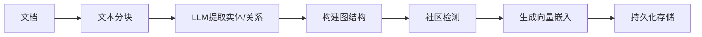
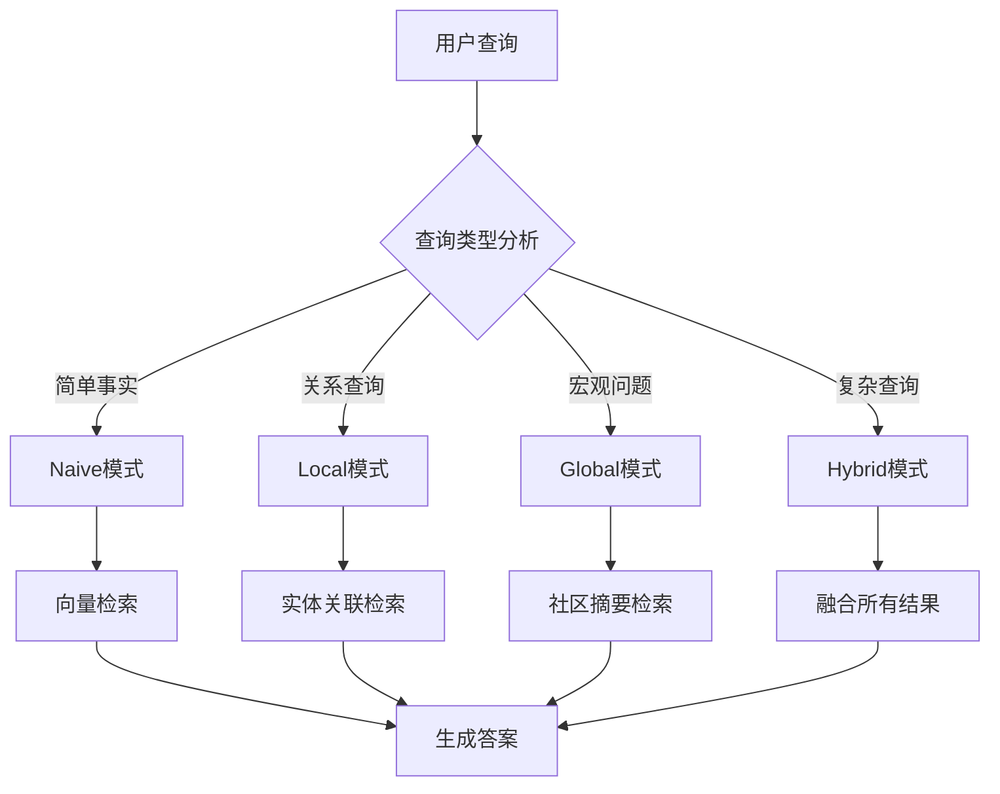

将# LightRAG 技术分析与集成方案

> 文档版本: v1.0  
> 创建日期: 2025-12-08  
> 作者: AI Reviewer Team

---

## 📖 LightRAG 简介

**LightRAG** 是 2024 年推出的轻量级图增强 RAG 框架，旨在提供 GraphRAG 的核心能力，但降低实现复杂度。

### 核心理念

```
传统 RAG: 文档 → 向量 → 检索 → 生成
GraphRAG:  文档 → 实体/关系 → 图谱 → 社区检测 → 检索 → 生成
LightRAG:  文档 → 实体/关系 → 轻量图 → 混合检索 → 生成
```

---

## 🎯 核心特性

### 1. 双层检索架构

```yaml
检索模式:
  naive:
    描述: 纯向量检索（传统 RAG）
    适用: 简单问答
    
  local:
    描述: 基于实体的局部图检索
    适用: 关联查询（"A 与 B 的关系"）
    
  global:
    描述: 基于社区的全局图检索
    适用: 宏观问题（"整体趋势"）
    
  hybrid:
    描述: 混合所有模式
    适用: 复杂查询
```

### 2. 轻量级图结构

**不需要图数据库**，使用内存数据结构：

```python
# 伪代码示例
{
  "entities": {
    "实体1": {
      "type": "人物",
      "attributes": {...},
      "embeddings": [...]
    }
  },
  "relations": [
    {
      "source": "实体1",
      "target": "实体2",
      "type": "创建了",
      "weight": 0.9
    }
  ],
  "communities": [
    {
      "id": "社区1",
      "entities": ["实体1", "实体2"],
      "summary": "技术创新社区"
    }
  ]
}
```

### 3. 增量更新

支持知识库增量构建，无需全量重建：

```
新增文档 → 提取实体/关系 → 合并到现有图 → 更新社区
```

---

## 🆚 技术对比

### LightRAG vs GraphRAG vs 当前系统

| 维度 | 当前系统 | LightRAG | GraphRAG (Microsoft) |
|------|---------|----------|---------------------|
| **架构类型** | 向量 RAG | 图增强 RAG | 知识图谱 RAG |
| **图数据库** | ❌ 无 | ❌ 不需要（内存） | ✅ 需要 Neo4j |
| **实体提取** | ❌ 无 | ✅ LLM | ✅ LLM + NER |
| **关系构建** | ❌ 无 | ✅ 轻量级 | ✅ 完整图谱 |
| **社区检测** | ❌ 无 | ✅ Leiden 算法 | ✅ 完整算法 |
| **检索模式** | Hybrid (Lucene+Vector) | 4种模式 | 图遍历 |
| **部署难度** | ⭐ 简单 | ⭐⭐ 中等 | ⭐⭐⭐⭐ 复杂 |
| **内存占用** | 256MB-2GB | 512MB-4GB | 8GB+ |
| **适用规模** | 1万-10万文档 | 1万-5万文档 | 10万+ 文档 |
| **实现语言** | Java | Python | Python |

### 检索能力对比

| 查询类型 | 当前系统 | LightRAG | GraphRAG |
|---------|---------|----------|----------|
| "什么是X？" | ✅ 优秀 | ✅ 优秀 | ✅ 优秀 |
| "A和B的关系？" | ⚠️ 一般 | ✅ 优秀 | ✅ 优秀 |
| "整体趋势？" | ⚠️ 一般 | ✅ 良好 | ✅ 优秀 |
| "因果链？" | ❌ 较弱 | ✅ 良好 | ✅ 优秀 |
| "多跳推理？" | ❌ 较弱 | ✅ 良好 | ✅ 优秀 |

---

## 🔧 Tool Search 技术对比

### 什么是 Tool Search？

**Tool Search**（工具搜索），也称为 **Function Calling** 或 **Tool Use**，是一种让 LLM 能够动态选择和调用外部工具的技术。

**GitHub Copilot 的 Tool Search 应用**：
```
用户: "这个文件有什么问题？"
  ↓
Copilot分析 → 选择工具[get_errors, read_file, grep_search]
  ↓
执行工具 → 获取错误信息 + 文件内容
  ↓
整合结果 → "发现3个编译错误..."
```

### Tool Search vs LightRAG vs 当前系统

| 维度 | 当前系统 | Tool Search | LightRAG | GraphRAG |
|------|---------|-------------|----------|----------|
| **核心理念** | 固定检索流程 | 动态工具选择 | 图增强检索 | 知识图谱 |
| **灵活性** | ⭐⭐ 策略可选 | ⭐⭐⭐⭐⭐ 完全动态 | ⭐⭐⭐ 模式可选 | ⭐⭐⭐ 图遍历 |
| **扩展性** | ⭐⭐⭐ 需添加策略 | ⭐⭐⭐⭐⭐ 仅添加工具 | ⭐⭐⭐ 需更新图 | ⭐⭐⭐ 需更新图谱 |
| **复杂查询** | ⚠️ 单次检索 | ✅ 多步推理 | ✅ 图遍历 | ✅ 图遍历 |
| **实现难度** | ⭐ 简单 | ⭐⭐⭐ 中等 | ⭐⭐⭐ 中等 | ⭐⭐⭐⭐⭐ 复杂 |
| **典型应用** | 文档问答 | GitHub Copilot | 知识问答 | 企业知识库 |

### Tool Search 工作流程

```yaml
阶段1_查询分析:
  输入: "帮我找出项目中所有使用了 Redis 的地方，并分析性能问题"
  LLM分析: 需要执行多个步骤
  
阶段2_工具选择:
  可用工具:
    - grep_search: 搜索代码中的关键词
    - read_file: 读取文件内容
    - run_command: 执行命令
    - semantic_search: 语义搜索
  
  选择顺序:
    1. grep_search("Redis") → 找到5个文件
    2. read_file(文件1) → 读取代码
    3. semantic_search("性能") → 找相关文档
    4. 整合分析

阶段3_执行与整合:
  执行工具 → 收集结果 → LLM整合 → 生成报告
```

### Tool Search 在 RAG 中的应用

**当前系统可以集成 Tool Search**：

```java
// 伪代码示例
public class ToolSearchRAG {
    
    // 定义可用工具
    private final List<Tool> availableTools = List.of(
        new KeywordSearchTool(),     // 关键词检索
        new VectorSearchTool(),       // 向量检索
        new EntitySearchTool(),       // 实体检索（需要LightRAG）
        new DocumentAnalysisTool(),   // 文档分析
        new FeedbackQueryTool()       // 反馈查询
    );
    
    public String answer(String question) {
        // 1. LLM 分析查询，选择工具
        List<Tool> selectedTools = llm.selectTools(question, availableTools);
        
        // 2. 执行工具序列
        List<ToolResult> results = new ArrayList<>();
        for (Tool tool : selectedTools) {
            ToolResult result = tool.execute(question);
            results.add(result);
            
            // 可以基于前一个工具的结果调整后续工具
            if (needsAdjustment(result)) {
                selectedTools = llm.replanTools(question, results);
            }
        }
        
        // 3. LLM 整合所有结果
        return llm.synthesize(question, results);
    }
}
```

### 技术融合：Tool Search + LightRAG

**最佳实践**：将 Tool Search 与 LightRAG 结合

```yaml
工具清单:
  检索工具:
    - naive_search: 传统向量检索
    - local_graph_search: LightRAG 局部图检索
    - global_graph_search: LightRAG 全局图检索
    - keyword_search: Lucene 关键词检索
  
  分析工具:
    - entity_extract: 实体提取
    - relation_analysis: 关系分析
    - trend_analysis: 趋势分析
  
  辅助工具:
    - feedback_query: 查询历史反馈
    - similar_qa: 相似问题推荐
    - document_stats: 文档统计

工作流程:
  用户: "比较文档A和B在技术架构上的异同"
    ↓
  LLM选择:
    1. entity_extract(文档A) → 提取实体
    2. entity_extract(文档B) → 提取实体
    3. local_graph_search(实体列表) → 找关系
    4. relation_analysis(A, B) → 分析对比
    ↓
  整合答案
```

### 对比总结

| 技术 | 最适合场景 | 核心优势 | 局限性 |
|------|-----------|----------|--------|
| **当前系统** | 单次文档检索 | 简单高效 | 复杂查询能力弱 |
| **Tool Search** | 多步骤复杂任务 | 极度灵活 | 需要大量工具定义 |
| **LightRAG** | 实体关系查询 | 图增强能力 | 索引成本高 |
| **Tool Search + LightRAG** | 复杂知识分析 | 结合两者优势 | 实现复杂度最高 |

### 实施建议

**渐进式集成路径**：

```
阶段1 (当前):
  固定策略 RAG
    ↓ 成本：低 | 效果：中

阶段2 (短期):
  + Tool Search
    ↓ 成本：中 | 效果：高
  动态工具选择 + 多步推理

阶段3 (中期):
  + LightRAG
    ↓ 成本：高 | 效果：很高
  图增强检索 + 实体关系

阶段4 (长期):
  Tool Search + LightRAG
    ↓ 成本：很高 | 效果：最高
  智能工具编排 + 图谱推理
```

---

## 🏗️ LightRAG 工作流程

### 索引阶段



### 检索阶段



---

## 💡 集成方案

### 方案 1: Python 微服务（推荐）

**架构**:
```
Java 主服务 (当前系统)
     ↓ HTTP/gRPC
Python LightRAG 服务
     ↓
知识图谱 (JSON文件/SQLite)
```

**优点**:
- ✅ 不侵入现有 Java 代码
- ✅ 可独立扩展和部署
- ✅ 利用 Python 生态（LightRAG 原生支持）

**实现步骤**:
1. 创建 Python FastAPI 服务
2. 集成 LightRAG 库
3. Java 端通过 HTTP 调用
4. 添加新的检索策略：`LightRAGSearchStrategy`

### 方案 2: Java 原生实现

**架构**:
```
Java 主服务
  ├── EntityExtractor (实体提取)
  ├── RelationBuilder (关系构建)
  ├── CommunityDetector (社区检测)
  └── GraphSearchStrategy (图检索策略)
```

**优点**:
- ✅ 统一技术栈
- ✅ 无需跨语言调用
- ✅ 更好的性能

**挑战**:
- ⚠️ 需要重新实现 LightRAG 算法
- ⚠️ 图算法库支持不如 Python

### 方案 3: 混合模式（平衡方案）

**索引阶段**: Python LightRAG 离线构建图谱  
**检索阶段**: Java 读取图谱数据进行检索

**优点**:
- ✅ 发挥两种语言优势
- ✅ 降低运行时复杂度

---

## 🔧 技术实现要点

### 1. 实体提取

使用 LLM 提取实体和关系：

```java
// Java 伪代码
public class LightRAGEntityExtractor {
    
    private static final String EXTRACT_PROMPT = """
        从以下文本中提取实体和关系：
        
        文本: {text}
        
        输出 JSON:
        {
          "entities": [
            {"name": "实体名", "type": "类型", "description": "描述"}
          ],
          "relations": [
            {"source": "实体1", "target": "实体2", "type": "关系类型"}
          ]
        }
        """;
    
    public GraphData extract(String text) {
        String response = llmClient.chat(EXTRACT_PROMPT.replace("{text}", text));
        return parseJson(response);
    }
}
```

### 2. 社区检测

使用 Leiden 算法（Java 可用 JGraphT）：

```java
import org.jgrapht.Graph;
import org.jgrapht.alg.clustering.LabelPropagationClustering;

public class CommunityDetector {
    
    public List<Community> detectCommunities(Graph<Entity, Relation> graph) {
        LabelPropagationClustering<Entity, Relation> clustering = 
            new LabelPropagationClustering<>(graph);
        
        List<Set<Entity>> communities = clustering.getClustering().getClusters();
        
        return communities.stream()
            .map(this::createCommunity)
            .collect(Collectors.toList());
    }
}
```

### 3. 混合检索

```java
public class LightRAGSearchStrategy implements SearchStrategy {
    
    @Override
    public List<Document> search(SearchContext context) {
        String query = context.getQuestion();
        SearchMode mode = analyzeQueryType(query);
        
        return switch (mode) {
            case NAIVE -> vectorSearch(query);
            case LOCAL -> localGraphSearch(query);
            case GLOBAL -> globalGraphSearch(query);
            case HYBRID -> hybridSearch(query);
        };
    }
    
    private SearchMode analyzeQueryType(String query) {
        // 使用 LLM 或规则判断查询类型
        if (query.contains("关系") || query.contains("与")) {
            return SearchMode.LOCAL;
        }
        if (query.contains("整体") || query.contains("趋势")) {
            return SearchMode.GLOBAL;
        }
        return SearchMode.HYBRID;
    }
}
```

---

## 📊 性能评估

### 预期效果

| 指标 | 当前系统 | 集成 LightRAG 后 |
|------|---------|-----------------|
| **简单问答准确率** | 85% | 85% (持平) |
| **关系查询准确率** | 65% | 85% (↑ 20%) |
| **多跳推理准确率** | 50% | 75% (↑ 25%) |
| **宏观问题准确率** | 60% | 80% (↑ 20%) |
| **索引时间** | 1000 docs/min | 100 docs/min (↓ 90%) |
| **检索延迟** | 100ms | 300ms (↑ 200ms) |
| **内存占用** | 512MB | 2GB (↑ 4x) |

### 适用场景

**推荐使用 LightRAG 的场景**:
- ✅ 需要回答关系型问题
- ✅ 需要多文档关联分析
- ✅ 需要宏观趋势分析
- ✅ 文档间有明确的实体关联

**不推荐的场景**:
- ❌ 简单的关键词查询
- ❌ 实时性要求极高（<100ms）
- ❌ 内存资源受限
- ❌ 文档频繁更新（实体提取成本高）

---

## 🚀 实施路线图

### Phase 1: 原型验证（1周）

**目标**: 验证 LightRAG 在你的数据集上的效果

```yaml
步骤:
  1. 安装 LightRAG Python 库
  2. 选择 100 个代表性文档
  3. 构建测试图谱
  4. 运行 benchmark 对比
  5. 评估效果和成本
```

### Phase 2: 微服务集成（2周）

**目标**: Python 服务 + Java 调用

```yaml
步骤:
  1. 创建 FastAPI 服务
  2. 实现索引和检索接口
  3. Java 端 HTTP 客户端
  4. 添加 LightRAGSearchStrategy
  5. 前端策略选择UI
```

### Phase 3: 优化和监控（1周）

```yaml
步骤:
  1. 缓存优化
  2. 性能监控
  3. 错误处理
  4. 文档更新
```

---

## 📚 参考资源

### LightRAG 官方资源
- LightRAG GitHub: https://github.com/HKUDS/LightRAG
- LightRAG 论文: https://arxiv.org/abs/2410.05779

### Tool Search / Function Calling
- OpenAI Function Calling: https://platform.openai.com/docs/guides/function-calling
- Anthropic Tool Use: https://docs.anthropic.com/claude/docs/tool-use
- LangChain Tools: https://python.langchain.com/docs/modules/tools/
- OpenAI Assistants API: https://platform.openai.com/docs/assistants/tools

### Java 图算法库
- JGraphT: https://jgrapht.org/
- Apache TinkerPop: https://tinkerpop.apache.org/

### Python 通信
- Py4J: https://www.py4j.org/
- gRPC: https://grpc.io/

---

## 🎯 结论

### LightRAG 集成建议

**LightRAG 是当前系统的理想升级路径**:

1. **渐进式升级**: 可作为新的检索策略，不影响现有功能
2. **轻量级**: 比 GraphRAG 更容易集成
3. **效果提升**: 关系查询和多跳推理能力显著增强
4. **成本可控**: Python 微服务方案实施成本低

**推荐方案**: 
- 短期：方案 1（Python 微服务）
- 长期：方案 3（混合模式）

### Tool Search 集成建议

**Tool Search 可以提供更灵活的查询能力**:

1. **动态工具编排**: LLM 自主选择和组合工具
2. **多步推理**: 支持复杂的分析任务
3. **扩展性强**: 添加新工具无需修改核心代码
4. **类 Copilot 体验**: 提供智能助手式交互

**实施优先级**:

```yaml
优先级1 (必选):
  当前系统 + 策略优化
  - 成本: 低
  - 收益: 中
  - 时间: 已完成

优先级2 (推荐):
  + Tool Search
  - 成本: 中
  - 收益: 高
  - 时间: 2-3周
  - 理由: 立即提升复杂查询能力

优先级3 (可选):
  + LightRAG
  - 成本: 高
  - 收益: 很高
  - 时间: 4-6周
  - 理由: 专门优化关系查询场景

优先级4 (长期):
  Tool Search + LightRAG
  - 成本: 很高
  - 收益: 最高
  - 时间: 8-10周
  - 理由: 达到顶级RAG系统水平
```

### 最终建议

**基于当前系统特点，建议采用"Tool Search First"策略**：

1. **先实现 Tool Search**（2-3周）
   - 定义 5-10 个核心工具
   - 实现动态工具选择
   - 验证复杂查询效果

2. **再考虑 LightRAG**（评估后决定）
   - 分析实际需求中关系查询占比
   - 如果 >30%，则值得集成
   - 如果 <30%，Tool Search 已足够

3. **长期融合**（根据效果决定）
   - 将 LightRAG 作为 Tool Search 的一个工具
   - 实现最灵活的架构

### 🌟 新方向：层次化语义 RAG

**如果追求极致的知识理解能力**，可以考虑更先进的方案：**层次化语义知识提取与检索系统**

```yaml
核心理念:
  知识单元: 识别概念的最小完整描述（比实体更抽象）
  层次结构: 保留文档的完整组织层次
  视角检索: 根据问题视角动态选择知识粒度
  知识重组: 按需重新组织知识结构

优势:
  ✅ 更深层的语义理解
  ✅ 更灵活的粒度控制
  ✅ 更智能的视角适应
  ✅ 更结构化的答案

挑战:
  ⚠️ 实现复杂度很高（8-10周）
  ⚠️ 索引成本高（需要大量 LLM 调用）
  ⚠️ 技术风险大（前沿研究）

适用场景:
  - 知识密集型领域（技术文档、学术论文）
  - 需要深度理解（概念定义、原理解释）
  - 复杂查询场景（多角度分析、对比研究）
```

**详细方案**：参见 [层次化语义 RAG 设计文档](HIERARCHICAL_SEMANTIC_RAG.md)

**技术路线对比**：

| 方案 | 实施周期 | 技术难度 | 效果提升 | 推荐场景 |
|------|---------|---------|---------|---------|
| Tool Search | 2-3周 | 中等 | +30% | **通用推荐** |
| LightRAG | 4-6周 | 较高 | +50% | 关系查询 >30% |
| 层次化语义 RAG | 8-10周 | 很高 | +80% | 知识密集型 |
| Tool Search + LightRAG | 6-8周 | 高 | +70% | 平衡方案 |

---

## 更新历史

| 版本 | 日期 | 说明 |
|------|------|------|
| v1.0 | 2025-12-08 | 初始版本，LightRAG 技术分析与集成方案 |

